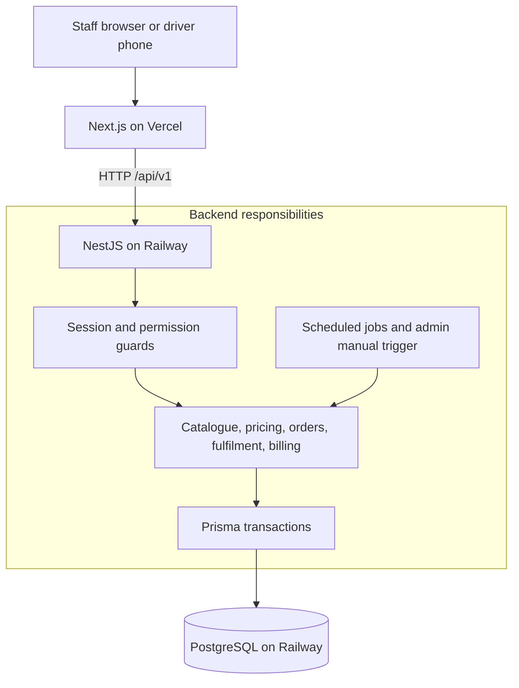
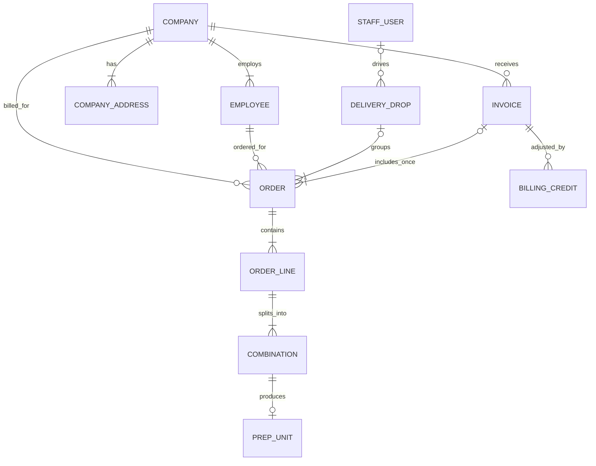
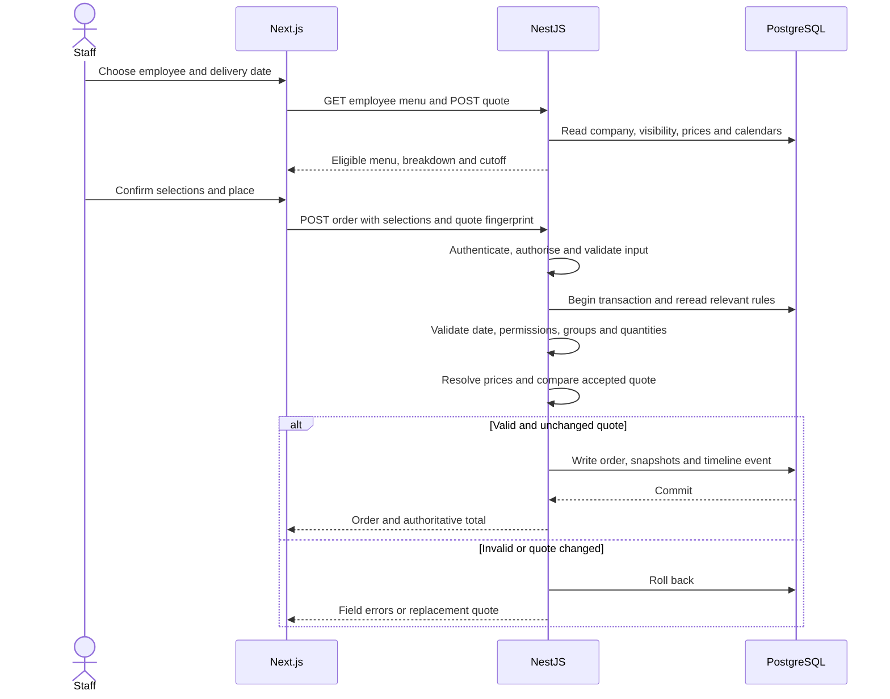
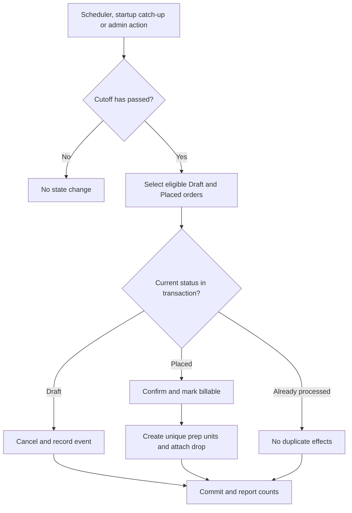
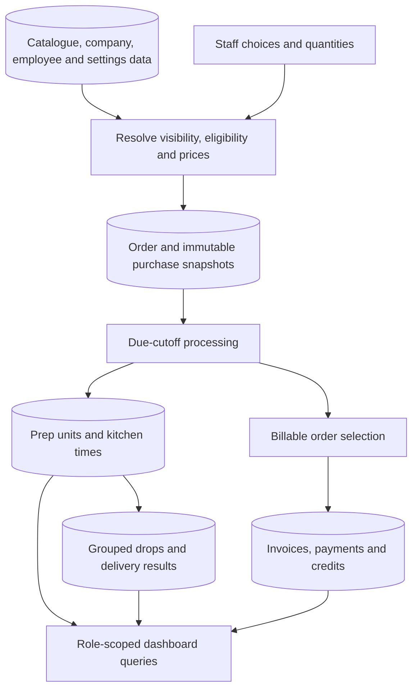
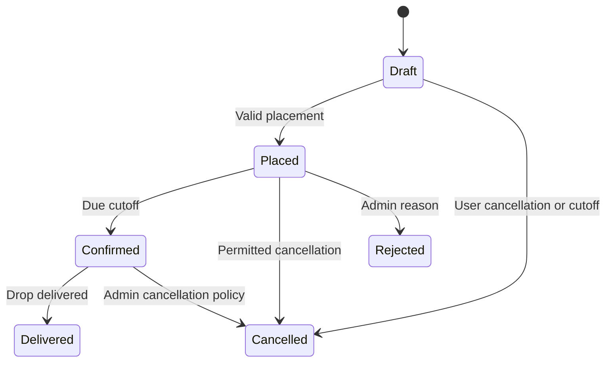

# Heizen: Fernleaf Kitchen implementation blueprint

Planning date: 3 October 2026, Asia/Kolkata. This is a proposed implementation plan, not a report of completed software.

The source of requirements is the supplied eight-page Heizen Engineering Assignment and the two email screenshots. Requirement section numbers below refer to that PDF. The email sets the deadline: **4 October, 11:59 PM IST**, with a public repository URL and a live URL submitted through its Google Form. Keep the deployment available for at least two weeks after submission.

## 1. What we are building

An internal operations application for a kitchen that supplies individual boxed meals to companies. Staff place orders for employees. Companies owe the money. Kitchen staff prepare food, dispatch staff organise deliveries, and drivers complete their assigned drops.

There are four staff roles and no employee login or customer storefront. An employee menu preview belongs inside the staff application.

The mandatory stack is **Next.js + NestJS + Prisma**. NestJS runs on Node.js; an Express-only backend would not meet the brief. All frontend business operations must call the NestJS API over HTTP.

Target the complete requested scope, but make a verified Must release the first milestone. Portions and CSV import start only after that milestone. No feature is complete just because its screen exists: it needs server rules, persistence, role checks, actionable errors, and proof that its main failure cases behave correctly.

## 2. Decisions to use as the starting point

| Area | Proposed choice | Reason |
| --- | --- | --- |
| Repository | TypeScript monorepo using pnpm workspaces | One commit can change an API contract and its consumer; straightforward local setup. |
| Frontend | Next.js App Router | Required; provides the application shell and staff routes. |
| Backend | NestJS modular monolith | Required; one deployable API with explicit domain modules. |
| Database | PostgreSQL | Relationships, constraints, transactions, aggregation and simultaneous edits fit this domain. |
| Database access | Prisma, owned exclusively by the API | Required; schema, migrations and typed database access. |
| UI | Tailwind CSS and shadcn/ui components | Consistent forms, dialogs and tables without a large design effort. |
| Fetching | TanStack Query | Server data, loading/errors, invalidation and restrained board polling. |
| Forms | React Hook Form; client validation for convenience | NestJS validation remains authoritative. |
| API validation | Nest DTO validation with a global validation pipe | Reject unknown fields, malformed dates, invalid IDs and invalid quantities. |
| Shared types | Public request/response contracts and enums in a workspace package | No Prisma models or secrets in browser imports. |
| Authentication | Opaque server sessions in PostgreSQL; password hashes | Immediate revocation and authoritative current-role checks. |
| Permissions | Central role-to-permission mapping plus resource ownership rules | Controllers check capabilities; adding a role does not require scattered name comparisons. |
| Money | Integer minor units; exact rational/BigInt intermediate calculations | No binary floating-point price arithmetic. |
| Time | One explicit kitchen zone: Asia/Kolkata; injectable clock | Tests, cut-offs and today stay independent of machine timezone. |
| Tests | Jest for rules/integration; Supertest for HTTP; a few Playwright journeys | Test difficult rules and the cross-role workflow. |
| Web hosting | Vercel | Direct fit for Next.js deployment. |
| API and DB hosting | Railway, same region/project; API sleeping disabled | A persistent API process can run cut-off and demo-data jobs. |

Pin mutually compatible stable framework, Prisma, Node and package-manager versions when scaffolding. Commit the lockfile. Use documentation for those pinned versions: Prisma's current documentation has changed transaction APIs, so do not mix a tutorial for an older major version with a newer client.

No Redis, microservices, message broker, Kubernetes or separate analytics database is required for this workload. Add infrastructure only to resolve an observed problem.

### Deployment trade-off

Railway currently lists a $5/month Hobby subscription including $5 of resource usage; usage above that is additional. This is a minimum, not a promise that the API and database will total $5. Select a budget and verify account eligibility/limits before purchasing or deploying. This plan has not provisioned or purchased anything.

A zero-cost fallback is possible using Render Free for the API and a PostgreSQL service, but Render Free sleeps after 15 idle minutes. An in-process scheduler will not execute while its process is asleep. That fallback needs an independently scheduled authenticated job, startup catch-up, and cold-start testing. Keep the recommended always-running API unless zero spend is a hard constraint.

Use HTTPS, a persistent database volume, a backup before significant migrations, an API health endpoint, and logs that make failed jobs visible. Do not rely on expiring trial credit for the two-week review window.

## 3. What the evaluators actually care about

The brief gives six evaluation areas, without numerical weights. The examples below are our proposed evidence, not undisclosed evaluator tests.

| Evaluation area | Evidence we should make easy to inspect |
| --- | --- |
| Domain modelling | Separate employee/staff identities, option combinations, immutable order snapshots, delivery drops and invoice membership. |
| Correctness | Tested holiday cut-offs, exact tier resolution and rounding, historical price preservation, totals that reconcile. |
| Product thinking | Four useful landing pages, usable operational boards, mobile driver flow, clear late/blocked states. |
| Engineering quality | Mandated stack, server validation, permission enforcement, transaction safety, clean types/lint and meaningful tests. |
| Judgement | Musts first, explicit assumptions, scoped handling of ambiguity, accurate list of incomplete work. |
| Communication | Working credentials, current demo data, understandable README, data model diagram and meaningful commit history. |

Spend effort first on the evidence above. Decorative charts do not compensate for an incorrect invoice or an unauthorised driver action.

## 4. Exact priority map

All eleven functional areas are Musts. A basic implementation of each is required before enhancements. Reference data includes an admin-managed portion-size list even when the full portions feature has not been enabled yet.

| Requirement | Priority | Minimum complete result | Build phase |
| --- | --- | --- | --- |
| Accounts and access | Must, ground rules | Four exact accounts, role landing pages, staff management, backend permissions and driver ownership scope. | 0, 4 |
| 4.1 Catalogue | Must | Dishes with all specified fields, reusable options, ordered required/optional groups, reference lists, deactivation and snapshots. | 1, 2 |
| 4.1 Portions | Explicit Should | Group-wide size set, every offered option supports it, per-option size surcharge, snapshot and total support. | 6 |
| 4.2 Menu | Must | Ordered active categories/items, company hiding, secret deep links, employee-specific preview. | 1 |
| 4.3 Pricing | Must | Default/company tiers, explicit and derived prices, overrides, five-cent rounding, missing-price exclusion, bulk tier editor. | 1 |
| 4.4 Companies | Must | Unique non-public domains, addresses, billing contacts, employee owner, working days/holidays, defaults and menu restrictions. | 1 |
| 4.5 Employees | Must | Exactly one company, move workflow, address/time/packaging permissions, allergies and dietary preferences. | 1 |
| 4.5 Employee CSV | Explicit Should | Independent row validation, good rows imported, row-numbered errors, duplicate policy and size limit. | 6 |
| 4.6 Orders | Must | Draft/place/edit/cancel/reject, combination validation, server quotes and snapshots, cutoff processing/manual trigger, filters/pagination/timeline, admin overrides. | 2 |
| 4.7 Kitchen | Must | One prep unit per distinct combination per order line, station filters, valid start/done actions, readiness timestamps, risk indicators and force completion. | 3 |
| 4.8 Dispatch/driver | Must | Exact drop grouping, driver assignment/default, ordered transition checks, mobile own-today view, optional note, on-time outcome. | 3 |
| Delivery photo | Optional within the Must workflow | Persistent image upload; delivery works without a photo. Do not describe the whole driver workflow as optional. | 6 if capacity |
| 4.9 Billing | Must | Uninvoiced confirmed orders, invoice creation/payment, unique order membership, coherent post-invoice change policy. | 4 |
| 4.10 Settings | Must | Staff-editable kitchen calendar, cutoff settings and application reference values. | 0, 1 |
| 4.11 Dashboards | Must | Four actionable role dashboards with exact documented definitions. | 4 |
| Non-functional rules | Must | Money/time correctness, concurrency, backend validation, pagination, 400-order board, lint/type-check and core-rule tests. | Every phase; gate 5 |
| Submission and review readiness | Must | Live link, public repo, README, useful demo data on review day, at least two-week availability. | 0, 5, 7 |

There is no individual feature explicitly tagged Could in the supplied functional sections. Our Could backlog is optional product polish: saved filters, keyboard shortcuts, richer empty-state guidance, or additional visual summaries. None precedes a failed Must test.

### Explicitly out of scope

Employee payment/refund flows; customer ordering app; customers without companies; extra order types; automatically included free options; date-based menus; employee ordering pauses; exports; accounting or recipe integrations; coupons; tax; delivery fees/zones; general audit-log product; email/notification delivery; marketing banners.

Order progress events are still required for the order timeline. They are narrow business records, not an added general-purpose audit-log system.

## 5. Build phases and gates

These are working time boxes, not guarantees. Reassess based on the acceptance gates. Tests and usable screens travel with each feature; phase 5 verifies the integrated release rather than starting all testing then.

| Phase | Deliverable | Gate before moving forward |
| --- | --- | --- |
| 0. Foundation and deployment proof | Monorepo, compatible pinned dependencies, PostgreSQL migrations, Nest health route, Next HTTP connection, login/session, permission map, four seed accounts, settings shell, first deployment. | A deployed browser signs in; an unauthorised API request fails; production API reaches the database. |
| 1. Rules and configuration | Money/calendar helpers, catalogue/options/reference lists, menu, tiers and matrix editor, companies/employees/settings, employee menu preview. | Missing prices and hidden items disappear; derived rounding works; company/owner/domain rules hold. |
| 2. Ordering and cut-off | Draft/place flow, combinations, snapshots, permitted overrides, list/detail/timeline, scheduled/manual cutoff. | A placed order survives a catalogue-price edit unchanged; cutoff confirms it exactly once and cancels drafts. |
| 3. Kitchen through delivery | Prep units, station board, risk times, force complete, grouped drops, assignment, dispatch steps, phone driver view. | One seeded order travels through all roles; invalid transitions and simultaneous clicks cannot duplicate work. |
| 4. Billing and useful dashboards | Invoice/payment/adjustment handling, role summaries, admin staff management completion, realistic seed scenarios. | Concurrent invoice requests cannot double-bill; dashboard totals reconcile to filtered records. |
| 5. Must release gate | Integration/security checks, 400-order board check, review-day fixtures, README definitions/diagrams, deployment smoke tests. | All Must acceptance checks pass on the deployed app; four real accounts work with correct scope. |
| 6. Should and optional work | Portions first, then row-wise employee CSV import; optional delivery photo if time remains. | Existing Must tests remain green after each addition. A half-finished enhancement is not released. |
| 7. Submission buffer | Fresh-browser/mobile review, final setup verification, clean commits, accurate README, public repo/link verification and form submission. | Working release and submission before the deadline; resources remain funded/available for two weeks. |

Suggested calendar in IST:

- **3 October:** decisions, deployed foundation, configuration/pricing, and a working order/cutoff path. Aim for one complete operational journey before ending the day's build.
- **4 October, first part of the day:** complete kitchen/dispatch/billing/dashboard coverage and the Must gate.
- **After the Must gate:** portions and CSV import within the remaining time.
- **4 October, 8 PM:** feature freeze; fix defects and verify delivery only.
- **4 October, 10 PM:** target submission, leaving almost two hours for unexpected deployment/form issues.

If behind schedule, drop Could polish, then optional photo, then incomplete Shoulds. Do not silently downgrade a Must, remove its tests to make the build green, or claim an unfinished feature as complete. Keep breaks and sleep in the schedule; the whole 45-hour wall-clock window is not usable coding time.

## 6. System architecture

A modular monolith means one backend deployment with separate modules for the business areas. The frontend renders forms and workflows; the API decides whether an action is valid; the database makes related changes atomic and enforces structural constraints.



Use a Next.js rewrite for `/api/v1/*` to the NestJS service. It proxies HTTP and contains no business rules. This keeps the browser on one origin while the actual API remains NestJS. Verify cookies through the deployed rewrite in phase 0.

Sessions use Secure, HttpOnly, SameSite cookies in production, a hashed opaque token in PostgreSQL, expiration and logout invalidation. NestJS validates mutation origins and a CSRF token. Do not treat CORS as authentication. Responses with private or changing operational data must not be publicly cached.

### Backend module responsibilities

| Module | Owns |
| --- | --- |
| auth/access/staff | Password verification, sessions, permission mapping, staff accounts. |
| catalogue/menu/pricing | Dishes, options, references, visibility and effective price resolution. |
| companies/employees | Company ownership/calendar/defaults and employee rules. |
| orders | Quoting, placement snapshots, lifecycle, combinations and progress timeline. |
| kitchen | Prep units, actual/planned times and readiness. |
| dispatch | Drops, grouping, assignment, dispatch and proof of delivery. |
| billing | Invoices, unique membership, payments and internal credits. |
| settings/calendar | Kitchen working days, holidays, cutoff calculation and shared clock. |
| jobs/demo | Due-cutoff processing, catch-up and clearly labelled review fixtures. |
| dashboards | Role-scoped read queries using documented definitions. |

Controllers accept HTTP inputs; services implement workflows; small pure functions implement pricing, cutoff and combination rules. Database queries remain in the backend. Do not create an abstract repository framework or event bus unless a concrete need appears.

## 7. Folder structure

| Path | Contents |
| --- | --- |
| `apps/web/app/(auth)/login/` | Login. |
| `apps/web/app/(panel)/` | Dashboard, catalogue, menu, pricing, companies, employees, orders, kitchen, dispatch, billing, staff and settings routes. |
| `apps/web/app/(driver)/today/` | Mobile driver landing page and delivery detail. |
| `apps/web/features/<feature>/` | Feature forms, tables, query hooks and API calls. |
| `apps/web/components/ui/` | Reusable UI primitives. |
| `apps/web/lib/` | HTTP client, formatting and query setup. |
| `apps/api/src/modules/<module>/` | Controller, DTOs, service, policy and module wiring. |
| `apps/api/src/domain/` | Pure money, pricing, calendar, combinations and transition rules. |
| `apps/api/src/common/` | Guards, request context, errors, pagination, clock and transaction helpers. |
| `apps/api/prisma/` | Schema, committed migrations and idempotent seed scripts. |
| `packages/contracts/` | Public API types, permission identifiers and shared enums. |
| `tests/integration/` | Real PostgreSQL and API tests, including concurrent requests. |
| `tests/e2e/` | A few Playwright user journeys. |
| `docs/` | Requirements checklist, decisions, diagrams, dashboard definitions and demo script. |
| Root files | README, workspace configuration, environment example, lockfile and CI configuration. |

Keep application routes thin. Do not put an entire feature into a single page file. Share response types, not database row objects.

## 8. Data model

### Essential distinctions

1. A **staff user** logs in. An **employee** is a company's customer record and does not log in.
2. An **order line** represents one dish and its total quantity. A **combination** represents a particular set of selected options and a portion of that quantity.
3. A **prep unit** is one distinct combination on one order line. Equal combinations on different orders remain distinct work records, even if the UI shows a combined summary.
4. A **drop** contains orders with the same company, address and exact delivery instant. Driver assignment and delivery happen at this level.
5. A catalogue value is editable. An **order snapshot** is evidence of what was bought and must remain stable.
6. An invoice references orders once; a later credit records an adjustment without rewriting the original invoice.



This core diagram omits lookup tables and drafts' temporarily incomplete children. The actual schema may let a draft have zero lines. A placed order may not.

| Area | Suggested tables and important fields |
| --- | --- |
| Staff | `StaffUser(id, email unique, passwordHash, role, active)`, `Session(tokenHash unique, userId, expiresAt)`. |
| Company | `Company(ownerEmployeeId, priceTierId nullable, defaultAddressId, deliveryTime, deliveryMinutes, packagingId, defaultDriverId, driverInstructions)`; `CompanyDomain(normalizedDomain unique)`; `CompanyAddress`; `CompanyWorkingDay`; `CompanyHoliday`. |
| Employee | `Employee(companyId required, email, name, canChooseAddress, canChangeTime, canChangePackaging)` plus allergy/tag joins. |
| References | Allergen, DietaryTag, KitchenStation, PortionSize, PackagingType. Retire referenced values instead of invalidating history. |
| Catalogue | Dish with SKU unique, description, image reference, temperature, costMinor, stationId nullable, minQuantity nullable and active flag. Reusable Option with independent cost/allergens/tags. Join tables for dish/option tags and allergens. |
| Choices | DishOptionGroup with required flag/display order/usesPortions; GroupOption with optionId/display order. Later: GroupPortion and GroupOptionPortion with surchargeMinor. |
| Menu | Category with active/secret/order; MenuItem with dish/category/active/order; CompanyHiddenCategory and CompanyHiddenMenuItem. |
| Pricing | PriceTier with manual/cost/reference rule and optional referenceTierId; DishTierPrice and OptionTierPrice with unique item+tier pair. Explicit entries override derivation. |
| Settings | Singleton KitchenSettings containing timezone and defaultPriceTierId, plus working days, holidays, cutoff time/day count and risk threshold. |
| Cutoff | DeliveryDateCutoff with unique date, cutoffAt, calendar-policy snapshot/version, processing metadata. Processing must still scan eligible orders; a date flag alone is not the idempotency mechanism. |
| Orders | Order with employeeId, companyId captured on placement, deliveryDate, deliveryAt, immutable address/company snapshot, packaging, cutoffAt, status, totalMinor, version and lifecycle timestamps; OrderLine, Combination, SelectionSnapshot and OrderEvent. |
| Preparation | PrepUnit with unique combinationId, station snapshot, status, startedAt and doneAt. Order also holds first kitchen start and all-units-ready time. |
| Delivery | DeliveryDrop with companyId, canonical address key/snapshot, deliveryAt, driverId, dispatch state/timestamps, delivery target snapshot, note/photo reference and onTime result. Order has nullable dropId until assigned to a live fulfilment group. |
| Billing | Invoice with companyId, number unique, immutable totalMinor, issuedAt, paidAt/paidAmountMinor; nullable Order.invoiceId (or InvoiceOrder with unique orderId); BillingCredit with orderId, invoiceId, amountMinor and reason. |
| Demo | DemoFixture with unique scenario/date key, or equivalent unique seed keys on generated records. |

Create a company and its first employee/owner in a transaction, or use a setup state that cannot accept orders until it has an owner. An owner must belong to that same company. Moving an owner to another company requires choosing a replacement owner first.

### Important database guarantees

- Normalized staff email, company domain and dish SKU are unique.
- Every employee has one non-null company reference.
- Exactly one default tier is referenced by the singleton settings row.
- One item/tier price entry, one prep unit/combination, and at most one invoice membership/order.
- One active drop key for `(companyId, canonicalAddressKey, deliveryAt)`; exact time, including date, matters.
- Prices and quantities have bounds and non-negative/positive checks as appropriate; missing price is different from zero.
- Foreign keys and restricted deletes protect historical references.

Rules spanning rows, such as quantity sums and owner membership, require transactional service validation as well as whatever structural constraints are possible. Prisma types alone do not enforce business rules.

## 9. Order placement sequence



The browser sends IDs, choices and quantities. It cannot decide the company's tier, unit prices, final total, driver scope or whether the deadline has passed. If a price changes between preview and submission, show a new quote and require the staff member to accept it.

## 10. Activity flow at cut-off



The manual action only processes an already-passed cutoff; it does not fast-forward real time or confirm future dates. Its response reports confirmed, cancelled, skipped and failed counts. The scheduled and manual paths call the same service.

## 11. Data flow



Changing the catalogue changes future resolution. It does not write backwards into purchase snapshots. Dashboards read recorded state; they do not invent numbers in the frontend.

## 12. Three separate lifecycles



| Object | States and constraints |
| --- | --- |
| Order | Draft, Placed, Confirmed, Delivered, Cancelled, Rejected. Kitchen and dispatch do not introduce extra commercial order statuses. |
| Prep unit | Pending, Started, Done. Pending can go directly to Done, recording both start and done. Repeated start/done cannot create a second transition. |
| Drop | Awaiting kitchen, Kitchen ready, Dispatch ready, Out for delivery, Delivered. Kitchen ready requires all active member orders ready. Departure requires a driver. |

A confirmed order becomes billable before it is delivered. An order can therefore be confirmed, uninvoiced and still cooking at the same time.

## 13. Business rules to settle before implementing screens

### Money and pricing

- Use one currency, **USD**, following the brief's dollar/five-cent examples. State this assumption. Store $2.15 as `215`, with validation that persisted values and totals fit the selected database integer range.
- Use exact integer/rational operations with BigInt intermediates for derived prices. Format only at the UI boundary. Never calculate prices with binary fractions such as `2.11 * 1.15`.
- Resolve `company tier ?? default tier`. Within that tier: explicit item price wins; otherwise derive using that tier's rule; otherwise price is missing. Do not fall back an individually missing company-tier item to the default tier.
- Cost-derived pricing uses cost; reference-derived pricing uses the referenced tier's resolved price. Reject reference cycles and invalid/missing reference rules.
- Round **derived unit prices** upward to a multiple of five cents before multiplying by quantity. Preserve explicit override prices as entered.
- For a nonnegative rational result `N / D` cents, rounded cents are `5 * ceilDiv(N, 5 * D)`. $2.11 becomes $2.15; $2.10 stays $2.10.
- Missing-price dishes are absent from the menu. An option without a resolved price is unavailable. If a required group has no valid priced option, hide the dish with an admin diagnostic in the pricing/preview tools.
- Order total equals the sum of combination totals, grouped into lines. Invoice total equals the sum of its immutable order amounts. Tax and delivery fees are zero because they are out of scope.
- A tier matrix shows each item, effective price, explicit/derived/missing source and editable override. Include dishes and options, with filters for missing prices.

### Combinations and snapshots

An $8 dish with six brown-rice combinations at $0.80 extra and four jeera-rice combinations at $1.20 extra totals:

`6 × 880 cents + 4 × 920 cents = 8,960 cents = $89.60`.

The line quantity is 10. It creates two prep units with quantities 6 and 4. Every required group must be satisfied in **both** combinations.

Assume a required group chooses exactly one option; an optional group chooses zero or one. The brief does not specify multi-select cardinality, so record this assumption. Disallow an option belonging to a different group and reject repeated group selections. Merge duplicate canonical combinations within a line. Sum quantities across duplicated dish entries, or prevent duplicate dish lines, so minimum order quantity cannot be bypassed.

At placement, store dish/option names, SKU, selected group/size, unit prices, quantities, resolved tier/source, station, allergen/tag information needed for prep, company and delivery snapshots. Freeze these independently of live catalogue records. Drafts may refresh estimates; an explicitly edited Placed order shows and accepts a fresh quote for the revision. Cutoff confirmation never silently reprices an order.

Moving an employee changes the rules for their next order and for resubmitted drafts. Already placed orders retain their captured company, prices and billing destination.

### Menu and employee constraints

Active category, active menu item, active dish, company visibility and resolved pricing must all pass. A secret category is omitted from normal navigation but has a staff-preview direct link. That link still applies company restrictions and pricing; secret is not an authorisation bypass.

Apply employee address/time/packaging flags on the API even though staff enter the order. Ordinary order creation uses company defaults when a flag is false. An explicit admin override is a separate action with its changed values and reason shown in the timeline.

Employee allergies/preferences are stored and shown with dish/option allergen warnings. The brief does not require automatic allergy filtering or a dietary matching engine; document that they are guidance, not guaranteed food-safety certification or an unrequested filtering rule.

Normalize domains to lowercase, reject malformed and well-known public-provider domains, and maintain the denylist as data. The unique database constraint prevents two companies claiming the same normalized domain. Explain that a maintained denylist is not proof of domain ownership. Do not add email/domain verification as a new project.

### Dates, calendars and cut-offs

- Delivery date is a local calendar date, not a UTC date obtained by slicing an ISO timestamp. Actual timestamps are UTC instants rendered in Asia/Kolkata.
- Starting before the delivery date, count backwards across **kitchen** working days, excluding kitchen holidays, then apply the kitchen cutoff time. Zero working days means the delivery date at the configured time.
- Company working days/holidays decide whether a delivery date is allowed. They do not move the cutoff.
- Example: Wednesday 7 October 2026, two working days, 16:00 gives Monday 5 October 16:00. If Monday is a kitchen holiday and weekends are non-working, the cutoff becomes Friday 2 October 16:00.
- At `now >= cutoffAt`, ordinary edits/cancellations are locked even if the scheduled job has not run yet. Admin exceptions use explicit override actions.
- Use one due-date cutoff record to coordinate processing. Do not reopen an already-processed date after changing settings. For unprocessed dates, preview/recompute affected cutoffs when kitchen policy changes and immediately process any now overdue dates.
- Reject company-calendar edits that would invalidate scheduled live orders and return affected order links; resolve those orders first. Do not leave scheduled orders silently impossible to deliver.
- Run a small due-order scan about once per minute and on API startup. It processes overdue dates, not just today's date. Use short transactions and bounded retries.
- Idempotency comes from conditional status transitions and uniqueness of side effects. A single `processed=true` flag must not hide newly added eligible admin/demo records.

### Kitchen timing

`plannedDispatchReadyAt = deliveryAt − companyDeliveryMinutes`

`plannedKitchenReadyAt = plannedDispatchReadyAt − 30 minutes`

For a 12:30 delivery with a 60-minute journey: dispatch-ready 11:30; kitchen-ready 11:00. Changing delivery time recomputes the planned times. Preserve actual historical timestamps.

Only active Confirmed orders can be worked. Order kitchenStartedAt is the earliest start across its units. kitchenReadyAt is set only when all its units are Done, with the latest unit completion as the actual readiness time. Finishing Pending records both start and completion. Force-completion records the missing unit times and a business timeline event.

Define late as unfinished work with `now > plannedReadyAt`. Define at risk as unfinished work with `0 <= plannedReadyAt − now <= 15 minutes`. Make 15 minutes a documented configurable assumption. Use labels/icons as well as colour; missing plan data is an explicit exception, not silently counted as on time.

### Drops and admin changes

Canonicalize the actual address fields to a grouping key. Shared company address IDs can supply the starting point, but changed text/custom addresses must not accidentally share an outdated key. Exact company, address and delivery instant determine membership; employee and packaging do not.

Default the driver from the company, but allow Dispatch/Admin to assign another active Driver. Dispatch-ready requires all non-cancelled member orders kitchen-ready. Out-for-delivery requires dispatch-ready plus a driver. Delivering the drop updates every active member order in the same transaction.

Before departure, an admin address/time edit atomically moves the order to the right drop, rechecks membership readiness and clears affected dispatch readiness where necessary. Packaging changes do not change the drop key. Preserve completed prep work.

After departure, use an explicit **drop-wide correction** for address/time because the orders are travelling together; show all affected orders before saving. Do not silently split a departed drop. After delivery, retain actual timestamps and the target captured at departure for the original on-time outcome, while recording any correction. Document this interpretation of broad admin override language.

Cancellation removes an undelivered order from active prep/drop counts and reevaluates its drop. If a drop becomes empty it cannot progress. A shortage discovered after delivery is recorded as an exception/credit, preserving the fact that delivery occurred.

Driver reads and writes must constrain by the authenticated driver ID and the current kitchen date. Never trust a driverId sent by the browser. On-time is `actualDeliveredAt <= targetDeliveryAt` using the target captured at departure; no grace period is assumed. Not-yet-delivered is unknown, not late or on time.

### Billing and post-invoice changes

Choose and document this policy:

1. Confirmation freezes purchased quantities/prices and creates full billability. Later logistical overrides do not change the purchased total.
2. A cancellation before invoicing makes the order ineligible for a new invoice. Its original order snapshot and cancellation history remain.
3. Invoice creation locks/claims selected eligible orders from **one company** and creates one immutable invoice in a transaction. A concurrent attempt cannot claim them again.
4. Cancelling an already-invoiced order creates an internal full credit; a delivered shortage can create an explicitly entered partial credit with a reason. Never remove its invoice membership or rewrite its original order/invoice total.
5. Credit totals for an order cannot exceed its invoiced amount. Repeat action IDs cannot create duplicate credits.
6. `invoice gross = sum(original order totals)` remains true. `net due = gross − credits − recorded payment`. If credit is issued after payment, a negative result is clearly shown as company credit, not discarded.
7. Mark-paid records settlement of the current outstanding amount. A paid invoice remains historical; credits do not pretend that money was refunded to an employee.

Internal credit records are a scoped way to answer the required post-invoice ambiguity. They are not payment processing or accounting integration.

## 14. Permissions and concurrency

| Capability | Admin | Kitchen | Dispatch | Driver |
| --- | --- | --- | --- | --- |
| Catalogue, pricing, company, employee, staff, settings writes | Yes | No | No | No |
| Create/manage orders | Yes | No | No | No |
| Relevant operational reads | All | Prep/order details needed for cooking | Delivery/order details needed for dispatch | Own drops today only |
| Start/finish prep unit | Yes | Yes | No | No |
| Force completion and override | Yes | No | No | No |
| Assign driver and dispatch | Yes | No | Yes | No |
| Mark drop delivered | Yes | No | No | Own eligible drop today |
| Billing writes and financial dashboard | Yes | No | No | No |

The brief does not grant Kitchen or Dispatch catalogue/order-authoring privileges; this plan assigns those to Admin. Document it. Return only role-appropriate fields, not a full record containing costs/billing information to every user.

Use permissions such as `catalogue.manage`, `orders.create`, `prep.complete`, `dispatch.assign`, `billing.manage` and `deliveries.complete.own`. Ownership/date checks are additional policies, not merely permissions.

For aggregate-changing workflows use PostgreSQL serializable transactions with bounded retry on serialization/deadlock conflicts, through a helper compatible with the pinned Prisma version. Use conditional state/version updates and database uniqueness as additional safeguards. Transaction retries do not mean replaying non-transactional external uploads.

| Race | Required protection |
| --- | --- |
| Two users finish one unit | One conditional transition; one event; second action returns an informative conflict or existing state. |
| Two last units finish simultaneously | Aggregate readiness calculation is in a serializable transaction; retry ensures the order eventually becomes ready. |
| Two orders finish within one drop | Safe aggregate drop readiness, or derive readiness from member orders inside the dispatch transaction. |
| Edit while cutoff runs | Recheck server time and version inside the transaction; no late edit sneaks in. |
| Two cutoff workers | Conditional Draft/Placed transitions; unique prep units and event/action keys. |
| Two staff invoice the same order | Unique order membership plus transaction; one succeeds, the other receives a conflict. |
| Duplicate order submission | Request idempotency key bound to user and payload; return the already-created result. |
| Driver marks delivery twice | Conditional drop transition updates all member orders once. |
| Regroup while dispatching | Membership and departure validation commit atomically; no mixed/stale drop. |

## 15. API outline

Use `/api/v1`. Exact route spelling can change; behaviour and permissions must remain clear.

| Area | Representative endpoints |
| --- | --- |
| Auth | `POST /auth/login`, `GET /auth/me`, `POST /auth/logout`. |
| Setup | CRUD for `/staff`, `/companies`, `/employees`, `/dishes`, `/options`, `/categories`, `/reference-data`; explicit deactivate routes where history is retained. |
| Pricing | `GET/PATCH /price-tiers/:id/matrix`, `GET /employees/:id/menu`, direct secret-category preview. |
| Orders | `POST /orders/quote`, `POST /orders`, `PATCH /orders/:id`, `POST /orders/:id/place`, `/cancel`, `/reject`, `/override`. |
| Query | `GET /orders?from=&to=&status=&companyId=&invoiced=&q=&page=&pageSize=`, `GET /orders/:id`. |
| Cutoff | `POST /cutoffs/process` with delivery date; admin only; date's cutoff must already have passed. |
| Kitchen | `GET /kitchen?date=&stationId=&status=`, `POST /prep-units/:id/start`, `/complete`, `POST /orders/:id/force-complete`. |
| Dispatch | `GET /drops?date=`, assignment, dispatch-ready and departure actions. |
| Driver | `GET /driver/today`, `POST /driver/drops/:id/deliver`. |
| Billing | `GET /companies/:id/uninvoiced-orders`, `POST /invoices`, `POST /invoices/:id/pay`, scoped credit endpoint. |
| Settings | `GET/PATCH /settings`, calendar/holiday administration. |
| Dashboards | Role-scoped `GET /dashboard` using the session's permissions. |

Errors use a consistent shape: `code`, human-readable `message`, optional `fieldErrors`, and a request ID. Examples: `CUTOFF_PASSED`, `COMBINATION_QUANTITY_MISMATCH`, `PRICE_MISSING`, `ORDER_ALREADY_INVOICED`, `STALE_VERSION`. A form must show where to fix the problem; a stale board action should offer refreshed state.

## 16. Dashboards with defensible calculations

All date-based operational metrics use **deliveryDate in Asia/Kolkata**, not creation date. Cancelled/Rejected orders are excluded from active work. Empty inputs show zero; undefined ratios show N/A. Missing timing data is shown as an exception.

| Role | What to show | Exact definition and purpose |
| --- | --- | --- |
| Admin | Today's committed orders/meals | Orders for selected delivery date in Confirmed or Delivered; meals are sum of their line quantities. Separate Draft and Placed counts prevent pretending they are committed. |
| Admin | Uninvoiced value | All dates: original totals of currently Confirmed/Delivered orders with no invoice, excluding cancelled/rejected. Label it all dates, and link to the exact filtered list. |
| Admin | Outstanding invoiced balance | All dates: sum gross minus credits minus recorded payment, with positive receivables and negative company credits shown separately. |
| Kitchen | Units remaining by station | Selected-date active Confirmed orders' units with status other than Done. A unit count is different from meal quantity; label both if shown. |
| Kitchen | Late/at-risk work | Unfinished units whose order planned kitchen-ready time is past/within the configured threshold. Show missing-plan exceptions separately. |
| Dispatch | Drops waiting, ready, unassigned, travelling | Selected delivery date; counts at drop level. An unassigned drop has no driver and is not cancelled/empty/delivered. Link each card to its filter. |
| Driver | My route and next stop | Own assigned drops for the kitchen's current date, ordered by deliveryAt then stable ID. Show active and completed sections. |
| Driver | Completed/on-time today | Delivered own drops / all own valid drops; on-time ratio only among delivered drops with a valid captured target. Zero delivered means N/A. |

For each dashboard README entry record fields queried, allowed statuses, date grouping, exclusions, missing-data treatment and omitted metrics. Avoid profit forecasts, employee satisfaction, or invented sales growth. Simple counts, queues and next actions are sufficient.

## 17. Test plan: acceptance evidence before polish

### Pure-rule tests

| Area | Cases |
| --- | --- |
| Cutoff | Normal week, weekend skip, kitchen holiday, company holiday not shifting cutoff, zero-day setting, exact boundary, browser/server timezone difference. |
| Pricing | Company/default tier, missing item without fallback, explicit override, cost/reference derivation, cycles, $2.11 to $2.15, exact nickel unchanged, missing option, no floating-point drift. |
| Combinations | Quantities sum exactly, zero/negative/fractional quantities rejected, required group per combination, wrong option group, duplicate choices, MOQ, canonical duplicates. |
| Timing | Delivery-minus-travel-minus-30, ready-time recalculation, risk boundaries, missing-time classification. |

### Database and HTTP integration tests

- Run against PostgreSQL, not SQLite, for transactions and constraint behaviour.
- Change catalogue prices/names after placing an order; order snapshots/totals do not change.
- Transfer the employee; historical company billing remains unchanged.
- Run cutoff twice, and concurrently: one confirmation/cancellation and one set of prep units.
- Race both final prep units; verify readiness is set and no transition is duplicated.
- Race invoice requests; verify an order belongs to one invoice only.
- Fail one invoice-selection validation; verify no partial invoice or membership remains.
- Cancel/credit an invoiced order; original invoice still reconciles and credit limits hold.
- Reject non-admin overrides and direct driver requests for another driver's drop or another date.
- Reject departure without a driver, dispatch before kitchen readiness, and repeated delivery.
- Verify grouped delivery updates every member order or none.
- Verify default flags cannot be bypassed through a crafted HTTP payload.

### Should-feature acceptance tests

- Portions: activating a portion-enabled group requires a complete option-by-size matrix; every selected option must have one of that group's sizes; an unrelated size is rejected; surcharge enters the unit-price snapshot and totals; catalogue edits do not change an old size/price snapshot.
- Portion surcharge policy: an explicit minor-unit surcharge per group-option-size applies on top of that option's resolved tier price. The brief does not define tier-specific portion surcharges, so this first implementation uses the same configured surcharge across tiers and documents it.
- CSV: valid and invalid rows in one file produce partial success with original row numbers and actionable errors; duplicated employee emails follow a documented skip/error policy; a row cannot import into a different company than the selected one; importing the same file again does not duplicate employees.
- Optional photo: allow delivery without one, reject unsupported/oversized files, store accepted uploads in persistent object storage, and verify access scope. Do not use the API container's temporary filesystem as permanent storage.

### UI and live smoke tests

One Playwright flow covers Admin placement, Kitchen completion, Dispatch assignment/departure and Driver delivery. Another covers invoicing and restricted access. Check phone-width usability for the driver, clear loading/empty/error states and usable keyboard focus.

Seed a separate 400-order busy-day dataset. Test server pagination, filtered kitchen responses, bounded query counts, readiness calculations and rendering. Aim for a responsive screen with measured results documented; do not claim a latency target was met without measuring it. Use stable sort order and server filtering, select only required fields, and index order date/status/company, prep order/station/status, drop driver/date, cutoff/status and invoice membership.

Poll boards at a restrained interval, pause polling in hidden tabs, and invalidate after successful actions. Only add list virtualization if the measured rendered workload requires it.

## 18. Realistic review data that stays current

Seed these accounts exactly; store password hashes, not plaintext database passwords:

| Role | Email | Password |
| --- | --- | --- |
| Admin | admin@test.com | Test@1234 |
| Kitchen | kitchen@test.com | Test@1234 |
| Dispatch | dispatch@test.com | Test@1234 |
| Driver | driver@test.com | Test@1234 |

Keep these intentionally public demonstration credentials scoped to synthetic data. Never publish hosting/database credentials with them.

Suggested demo dataset: at least three companies, 20–30 employees, 12–15 realistic dishes, reusable options and required groups, three tiers, hidden and secret categories, missing-price examples, several stations and every order status. Include past orders, today's active work, next-week scheduled orders, unpaid/paid invoices and credits. Use placeholder or licensed dish images that remain accessible.

The date-sensitive fixture job is a **deployment requirement**, not later polish:

1. Initial seed creates recent history and a future window, with scenario/date unique keys.
2. On startup and shortly after local midnight, a demo-only job fills missing fixture dates and appends today's operational showcase if missing.
3. Today's sample includes already-ready/out-for-delivery drops for `driver@test.com`, with coherent synthetic prior timestamps. Clearly document this as generated demo history.
4. At least one demo company operates seven days a week so a weekend reviewer sees valid deliveries. Other companies demonstrate the Monday–Friday default and holidays. Configure consistent kitchen/demo calendars too.
5. Use idempotent insert-if-missing behaviour. Do not wipe/reseed the database or reset records the reviewer has edited or completed.
6. Keep the clock real. Never redefine today as submission day or make the driver query display tomorrow's orders as today's.

Demo data generation is separate from production domain validation. A historical fixture builder may construct consistent past history; ordinary API callers cannot bypass deadlines through that path.

## 19. Working with Codex

Use one phase or a small feature slice per instruction. Each request should state requirement sections, accepted assumptions, relevant modules, error cases and the acceptance gate.

For each slice:

1. State the business invariant in plain language and an example.
2. Ask for the smallest migration/API/UI change that implements it.
3. Ask Codex to run the relevant checks and show what passed, failed or was not tested.
4. Review the API action and its tests yourself; explain why the data model and transaction are sufficient.
5. Exercise it in the browser, update the requirement checklist and commit a meaningful change.

Good AI tasks: framework setup, migrations from an agreed model, repetitive forms/tables, DTOs, typed HTTP hooks, seed builders, test cases from agreed invariants, and documentation drafts.

Decisions to personally understand and review: price precedence/rounding, cutoff counting/timezone, permission boundaries, snapshot lifetime, drop membership, transaction races, invoice adjustments and what the dashboard numbers mean.

Do not ask for the entire application in one unreviewed generation. Do not add unrequested abstractions, fake tests or invented claims to make the submission look larger. The brief explicitly requires being able to explain every line submitted.

### Initial coding handoff

```text
Build Phase 0 of the Fernleaf Kitchen assignment using this blueprint.
First inspect the existing repository and its instructions. If empty, create a
TypeScript pnpm workspace with apps/web (Next.js), apps/api (NestJS), and
packages/contracts. Use PostgreSQL and Prisma with compatible pinned versions.

Implement API health, database connectivity, password-hashed seeded staff users,
opaque session login/logout/me, a central permission map, and role landing shells.
Proxy the web app's API requests over HTTP to NestJS. Keep Prisma and business
rules out of Next.js. Include environment examples without real secrets and
local setup instructions.

Seed the four exact assignment credentials. Prove an unauthorised API mutation
is rejected. Run lint, type-check, builds and relevant auth integration checks.
Report changes, commands/results and limitations. Do not implement later phases
until this foundation can be reviewed. Do not purchase hosting or submit forms.
```

## 20. README and submission checklist

- Local install, environment, database migration, seed, run and test instructions.
- Chosen timezone/currency and pinned toolchain versions.
- Architecture and data model diagrams.
- Price resolution, cutoff counting, snapshots, transitions and concurrency decisions.
- Exact dashboard definitions and intentionally omitted metrics.
- Implemented/skipped/next scope with honest reasons; explicit assumptions from this document.
- Four demo credentials, role walkthrough and how to trigger a past cutoff manually.
- Explanation of generated rolling demo data and the two-week availability plan.
- Actual lint/type-check/test results and remaining limitations.
- Meaningful commits while building; no fabricated or backdated history.
- Confirm the repository is public as the email asks, and free of secrets.
- Confirm the live page is accessible without a hosting-provider login wall.
- Test all four accounts using a fresh browser context and the driver flow at phone width.
- Submit the live URL and repository URL via the email's actual Google Form; no fabricated form link.

## 21. Source notes

Assignment-derived requirements above come from the supplied PDF, sections 1–9. Deadline, public repository requirement and submission route come from the supplied email screenshots. Proposed technology choices and ambiguity policies are recommendations, not statements from Heizen.

Official documentation checked during planning:

- [Railway plans and included usage](https://docs.railway.com/pricing/plans)
- [Railway PostgreSQL service and connections](https://docs.railway.com/databases/postgresql)
- [Railway Serverless/app sleeping](https://docs.railway.com/deployments/serverless)
- [Render Free service limitations](https://render.com/docs/free)
- [Next.js on Vercel](https://vercel.com/docs/frameworks/full-stack/nextjs)
- [Next.js rewrites](https://nextjs.org/docs/app/api-reference/config/next-config-js/rewrites)
- [NestJS task scheduling](https://docs.nestjs.com/techniques/task-scheduling)
- [Prisma transaction fundamentals](https://www.prisma.io/docs/orm/fundamentals/transactions)

Hosting prices and limits can change. Verify the selected account's actual configuration before deployment.
