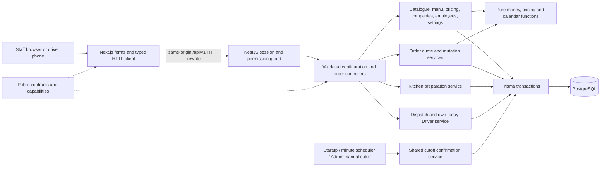
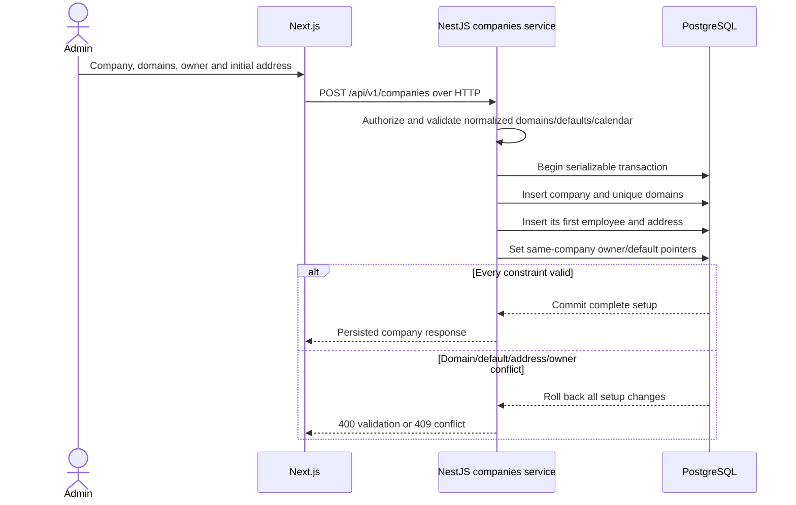
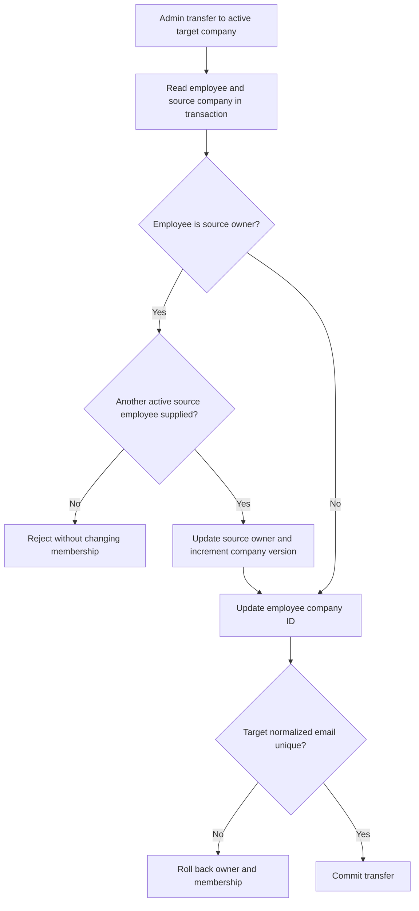
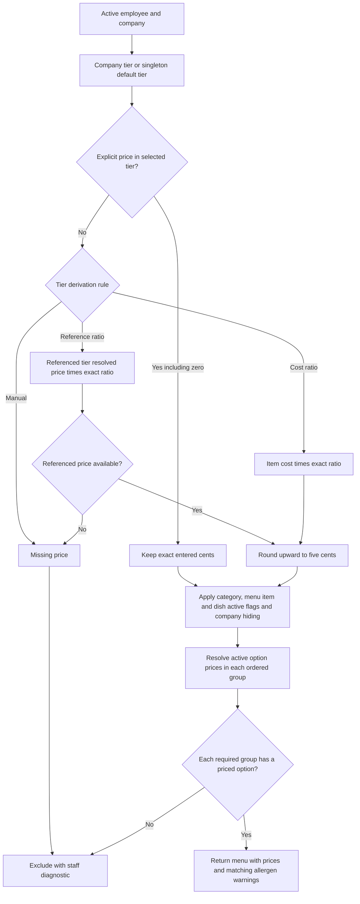
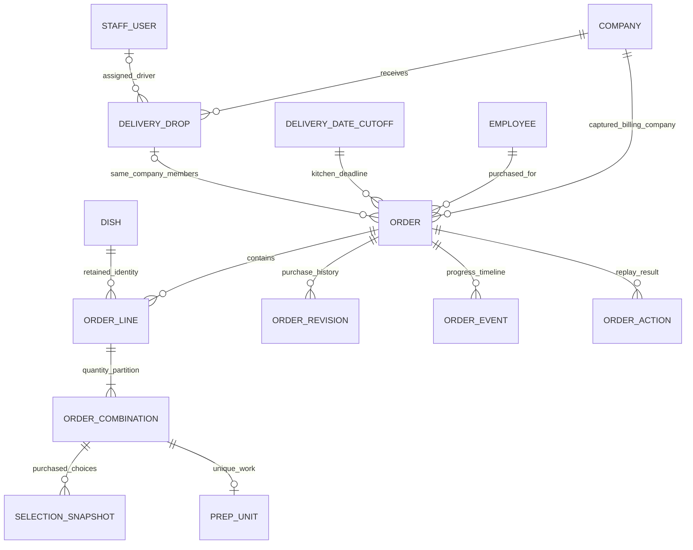
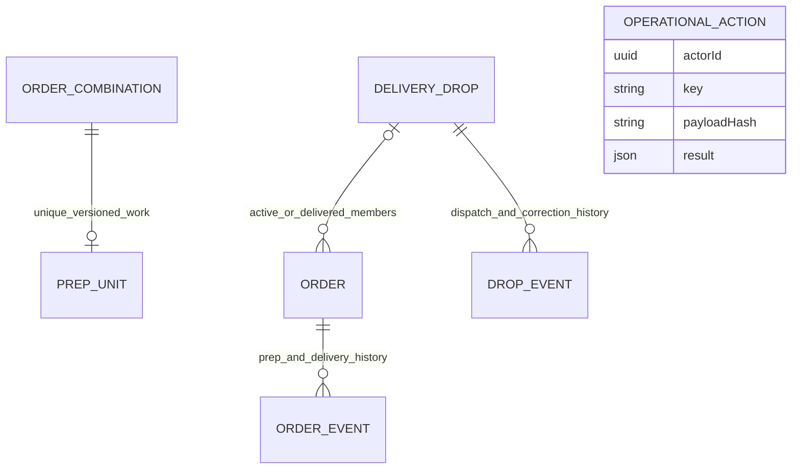

# Architecture: configuration, orders and fulfilment

The current application includes configuration, orders/cutoffs, kitchen, grouped dispatch/Driver, billing/credits, staff management, role summaries and rolling review fixtures. Release fixes and actual checks are tracked in [release verification](release-verification.md), [billing evidence](phase-4-release.md), [demo jobs](demo-fixtures.md) and [deployment record](deployment.md). Historical phase evidence below describes its original checkpoint; live verification is a separate gate.

The browser renders Next.js forms and calls relative `/api/v1` URLs. Next.js rewrites those requests over HTTP to NestJS. Authentication, permissions, validation, pricing, calendars and Prisma access belong to the backend. No Next.js page/server action accesses Prisma.

All protected requests read current staff activation/role and session expiry. Mutations also validate exact `Origin` and session-bound CSRF. Configuration routes require Admin capabilities; direct non-Admin API requests fail even if a client shows a button. Missing access policies fail closed. API errors have a request ID and actionable code/message; responses use `no-store`.

## Actual configuration data model

```mermaid
erDiagram
    STAFF_USER ||--o{ SESSION : authenticates
    STAFF_USER o|--o{ COMPANY : default_driver
    COMPANY ||--|{ EMPLOYEE : employs
    EMPLOYEE o|--o| COMPANY : owner
    COMPANY ||--|{ COMPANY_DOMAIN : claims
    COMPANY ||--|{ COMPANY_ADDRESS : has
    COMPANY_ADDRESS o|--o| COMPANY : default_address
    PRICE_TIER o|--o{ COMPANY : selected_tier
    PRICE_TIER ||--o| KITCHEN_SETTINGS : default_tier
    PRICE_TIER o|--o{ PRICE_TIER : reference_rule
    DISH ||--o{ DISH_OPTION_GROUP : defines
    DISH_OPTION_GROUP ||--o{ GROUP_OPTION : contains
    OPTION ||--o{ GROUP_OPTION : reused
    CATEGORY ||--o{ MENU_ITEM : contains
    DISH ||--o{ MENU_ITEM : appears_in
    COMPANY ||--o{ COMPANY_HIDDEN_CATEGORY : restricts
    CATEGORY ||--o{ COMPANY_HIDDEN_CATEGORY : hidden_for
    COMPANY ||--o{ COMPANY_HIDDEN_MENU_ITEM : restricts
    MENU_ITEM ||--o{ COMPANY_HIDDEN_MENU_ITEM : hidden_for
    PRICE_TIER ||--o{ DISH_TIER_PRICE : prices
    DISH ||--o{ DISH_TIER_PRICE : overridden_by
    PRICE_TIER ||--o{ OPTION_TIER_PRICE : prices
    OPTION ||--o{ OPTION_TIER_PRICE : overridden_by
    REFERENCE_VALUE o|--o{ DISH : station
    REFERENCE_VALUE o|--o{ COMPANY : packaging
    DISH ||--o{ DISH_ALLERGEN : contains
    REFERENCE_VALUE ||--o{ DISH_ALLERGEN : allergen
    DISH ||--o{ DISH_DIETARY_TAG : tagged
    REFERENCE_VALUE ||--o{ DISH_DIETARY_TAG : dietary_tag
    OPTION ||--o{ OPTION_ALLERGEN : contains
    REFERENCE_VALUE ||--o{ OPTION_ALLERGEN : allergen
    OPTION ||--o{ OPTION_DIETARY_TAG : tagged
    REFERENCE_VALUE ||--o{ OPTION_DIETARY_TAG : dietary_tag
    EMPLOYEE ||--o{ EMPLOYEE_ALLERGEN : guidance
    REFERENCE_VALUE ||--o{ EMPLOYEE_ALLERGEN : allergen
    EMPLOYEE ||--o{ EMPLOYEE_DIETARY_TAG : preference
    REFERENCE_VALUE ||--o{ EMPLOYEE_DIETARY_TAG : dietary_tag
```

The complete model is `apps/api/prisma/schema.prisma`; committed migrations add database checks. API-created companies have at least one domain/address/employee. Owner/default-address pointers are nullable only for intermediate setup; creation fills them before committing. Composite foreign keys pair the pointer with company ID, structurally rejecting a foreign-company owner/address. Each employee has exactly one required company. Emails are normalized and unique within their company; staff emails and company domains are globally unique. SKU is unique. Category/dish membership, option/group membership, reference joins and item/tier overrides have compound uniqueness.

ReferenceValue uses an enum kind for allergens, dietary tags, kitchen stations, portion sizes, packaging and public email-provider domains. Services validate the kind before assigning references. Records retire through active flags and retain joins. An active station used by an active dish, or packaging used by an active company, cannot retire until reassigned. Existing employee/dish allergen guidance remains readable after its reference retires.

Company and singleton KitchenSettings keep `workingDays` integer arrays (`0=Sunday` to `6=Saturday`) and `holidays` local-date arrays. This avoids extra lookup tables for a fixed seven-day week. Services validate unique days, at least one open day and real holiday dates. Settings fixes USD/Asia/Kolkata and references exactly one default tier. Company calendars determine delivery eligibility; only the kitchen calendar counts cutoff days.

Order snapshots, date-cutoff records, prep units and delivery-drop foundations now exist in the Phase 2 schema; see the model below. Invoices and rolling operational fixtures do not exist yet. Their future billing/operational relationships remain labelled planned in [lifecycle diagrams](diagrams.md).

## Atomic company setup and employee transfer

Company/settings/order saves include the last-read version. Conditional updates increment it and reject stale saves with 409. Configuration and order writes use serializable isolation for at most three attempts. Serialization/deadlock conflicts roll back before asynchronous 20/40 ms backoff; a persistent conflict returns `409 CONCURRENT_CHANGE`. This gives a winning transaction time to commit without holding locks during the delay. PostgreSQL uniqueness/FKs provide a second guard. Menu previews, price matrix and order list/detail reads use Repeatable Read for coherent responses. Order action replay, version races and concurrent cutoff processing have focused PostgreSQL evidence; aggregate fulfilment/invoice concurrency remains later-phase work.

## Effective pricing and menu availability

Tier references must be acyclic, including concurrent cross-reference edits. Integer/rational arithmetic uses BigInt intermediates, then validates the final PostgreSQL Int amount. Missing selected-tier prices do not look up the kitchen default as a fallback. Explicit overrides are not nickel-rounded. Secret categories are omitted from normal navigation; direct staff preview evaluates the same visibility/pricing rules. Optional groups may have no available option; required groups cannot.

Menu previews remain read-only configuration views. The Phase 2 order quote calls `MenuService.previewInTransaction` inside its own transaction, applying the same active/hiding/pricing/required-option rules. The registered quote policy follows the user's confirmed Option A: exactly one option per required group, zero or one per optional group, duplicate dish lines rejected, and canonical duplicate combinations merged within one line. Combination quantities must sum to the line quantity; MOQ applies to that line. Ordinary delivery addresses must be active saved addresses of the employee's company. A false address/time/packaging flag enforces the corresponding company default. Custom addresses and exceptions to these flags use a separate reason-required Admin override. The browser selects IDs/quantities and reviews the server quote; it cannot supply authoritative prices or bypass these checks.

## Phase 2 persisted model and history boundaries

Drafts can contain zero lines; a placed order requires valid purchased lines/combinations. An order captures company identity separately from its employee's current company. Employee transfer does not alter the order's original billing company or accepted purchase. OrderLine retains a restricted FK to Dish, but its dish name/description/SKU/station/allergen data and prices come from snapshots. `menuItemId` is a historical identifier without a live MenuItem FK. SelectionSnapshot's group/option/tier IDs and PrepUnit's station ID likewise identify purchased history without live choice/reference FKs. Catalogue group replacement therefore cannot erase selection history. Actor IDs in order actions/events/revisions and `createdById` are historical scalar IDs; events retain the actor name.

Purchase JSON and typed line/combination/selection rows capture server-resolved prices, quantities and choice information. Accepted placed revisions append a unique `(orderId, version)` full snapshot; earlier revision snapshots stay unchanged. Current delivery logistics are stored separately from purchase snapshots. The detail UI displays **Current delivery** alongside **Recorded purchase**, and timeline entries can show before/after delivery corrections or kitchen cutoff changes in IST. OrderEvent has a unique increasing database sequence; ordering by timestamp then sequence preserves event order when placement and confirmation share the same millisecond. Database triggers reject updates to purchase revisions and events. Status checks require purchase/placement evidence for Placed/Confirmed/Delivered, the applicable confirmation/cancellation/rejection timestamp, positive versions/quantities, nonnegative money and exact combination multiplication. Post-transfer Placed purchase edits/requotes are rejected; explicit logistics corrections/cancellation stay available. The registered HTTP endpoints and builder have local API/browser evidence.

Database uniqueness covers order number, one dish row per order, canonical combination per line, one prep unit per combination, actor/action ID, order/action-event key and order/revision version. Duplicate dish lines are rejected before writing; variants belong to that dish line's combinations. OrderAction stores a canonical payload hash and committed response: an identical actor/action retry replays its result; reusing its key for different input returns 409. Mutation response caching occurs inside the same transaction as purchase/history/confirmation effects. Mutations use expected order versions and serializable transactions with bounded retries.

Each DeliveryDrop has globally unique `(companyId, canonical actual address key, exact deliveryAt)`. Address identity/label, employee and packaging do not determine grouping. Address fields normalize whitespace/case/Unicode before hashing; actual delivery timestamps include the date. The composite Order drop FK `(dropId, companyId)` references `(DeliveryDrop.id, companyId)`, structurally preventing cross-company membership. A default driver is copied only when the staff record remains active and has Driver role. Joining a departed/delivered drop is rejected. Driver departure/delivery actions are implemented and locally verified in Phase 3.

## Phase 3 operational extensions — locally verified

The schema adds a positive preparation-unit version for conditional actions, the drop's actual kitchen-ready time, an ordered DropEvent timeline and OperationalAction replay records. Additive migrations `20261004030000_phase_3_operations`, `20261004030500_operation_history_immutable` and `20261004031000_readiness_history_system_actor` are applied to development, the guarded integration-test and separate browser-test databases; all eight migrations are present and reviewer data/purchase snapshots were preserved. DropEvent updates are rejected through the existing immutable-history trigger function, and its actor is nullable for injected-clock automatic readiness updates. The 23-case focused PostgreSQL operational suite passes; final local browser/regression/policy gates pass in [Phase 3 evidence](phase-3.md).

OperationalAction has unique `(actorId, key)` and keeps a payload hash plus committed public response in the transition's transaction. Its actor/resource identifiers are historical scalars, not a new foreign-key claim on live users/orders. The hash binds the action to its exact operation, resource and payload. Driver replay must still pass current ownership and kitchen-date scope before returning cached data. DropEvent belongs to one drop and orders by timestamp plus unique insertion sequence; event actor name/reason preserve the business history.

The current readiness gate is the drop status plus its active member orders, not simply the existence of an old actual timestamp. Every membership change increments the drop version, even if readiness/state stay the same or an order leaves after departure; a stale membership preview cannot authorize departure/correction. Readiness/membership history records before/after state and actual times plus member IDs/count, with injected-clock system events where no staff actor exists. Invalidation preserves last recorded readiness fields; renewed readiness can recalculate the current active-set aggregate while immutable events preserve older values. The user confirmed packaging invalidation before departure/locking afterward and reasoned Admin travelling-Driver reassignment; those additions are implemented and tested. Operational DTOs omit purchase amounts, costs and billing; Admin financial order details use their separate permission-protected HTTP route.

**Drop-plan interpretation:** each order uses its accepted company's captured travel minutes, with dispatch plan = delivery instant minus travel and kitchen plan another 30 minutes earlier. Orders from the same company/actual address/exact delivery instant can therefore have different plans if the company's travel minutes changed between purchases. The drop view uses the earliest member kitchen/dispatch planned deadline, preventing a later purchase from hiding earlier required preparation. This minimum-deadline aggregation is our engineering interpretation, not extra wording attributed to the missing assignment PDF. Actual drop kitchen readiness is the latest readiness of its active member orders.

## Date policy and atomic confirmation

DeliveryDateCutoff has one row per local delivery date, UTC `cutoffAt`, settings version, policy JSON and first/latest processing times. Its policy captures kitchen timezone, weekdays, holidays and cutoff time/day count. Authoring a quote ensures that date's record exists. For unprocessed dates, a settings transaction recalculates deadlines, updates affected Draft/Placed cutoff instants/versions and adds `CUTOFF_CHANGED` events. Catch-up runs after that transaction commits. Processed dates retain their original policy and cutoff; policy edits cannot reopen them.

`processedAt` freezes policy; it does not certify that all orders were processed successfully. Every due-date retry scans the date's orders again. This finds newly added eligible records and recovers failed rows without duplicate effects. Manual processing rejects a future cutoff and returns confirmed/cancelled/skipped/failed counts plus failed order references. Startup catch-up and an approximately one-minute timer call the same service; an in-process running flag avoids overlapping local scans. The timer is disabled under `NODE_ENV=test`; startup catch-up is covered by the PostgreSQL suite. Hosted scheduling/live uptime remains unverified.

The shared `confirmPlaced` transaction rechecks the order/date deadlines against the real clock, freezes date policy, conditionally changes an already-due Placed order to Confirmed, creates one pending prep unit per canonical purchased combination, attaches the exact grouped drop and adds the unique cutoff timeline event. Ordinary processing never recalculates purchase prices. Draft cancellation is conditional and records its reason/event. Per-order transactions isolate failures in a date scan; a failed order is reported for later retry. A reason-required **new late Admin placement**, or explicit late placement of an existing draft, uses this same helper immediately within its placement transaction after accepting the authoritative quote. The cached action response is therefore already Confirmed; any failure rolls back the purchase, confirmation and replay result together. A future delivery date before its cutoff remains Placed rather than being artificially confirmed.

Explicit pre-departure delivery corrections keep company/billing/purchase amounts unchanged, recalculate planned readiness and move Confirmed membership between exact drops. Existing prep history is preserved. Confirmed cancellation clears drop membership while preserving historical preparation rows and actual timestamps; Phase 3 active-work reads must restrict parent orders to Confirmed. Company-calendar edits reject changes that would invalidate Draft/Placed/Confirmed delivery dates and return affected order links. Kitchen-board start/done/readiness, dispatch and own-today Driver completion are locally verified Phase 3 behavior; invoices/payments/credits are implemented; release checks are recorded separately.

## Implemented and locally verified HTTP/UI scope

The registered order controller exposes list/detail, quote, Draft/Placed creation/update, place/cancel/reject and explicit Admin placement/delivery/cancellation/rejection exceptions. Each route declares backend capabilities; current order-management/read capabilities belong to Admin. Later operational roles receive scoped fulfilment data in Phase 3. List filters use delivery-date `from/to`, company, status, invoice membership, search and server pagination. The Phase 2 invoice model is absent, so an invoiced-only query has no matches. The independent Next.js list/detail/timeline/revision/action/manual-cutoff UI uses the HTTP rewrite, CSRF and preserved API error details. Company/calendar errors render links from `details.orders`.

The builder at `/orders/new` and `/orders/:id/edit` chooses employee/company delivery defaults and menu combinations, preserves draft choices and reviews the authoritative quote before placement or a placed purchase revision. Editing inputs invalidates prior acceptance; a changed server quote must be reviewed again. Reason-required override mode makes custom-address/flag exceptions and late placement explicit. Lint/type-check/build and the complete 20-case production-build browser suite passed the Phase 2 baseline, alongside 118 backend/rule tests and the API container smoke. README and [Phase 2 evidence](phase-2.md) record exact results, commit/push/CI and deployment status. [Sequence/activity/state diagrams](diagrams.md) now also show implemented Phase 3 operations with focused API evidence, while its local gate passes and billing is planned.
