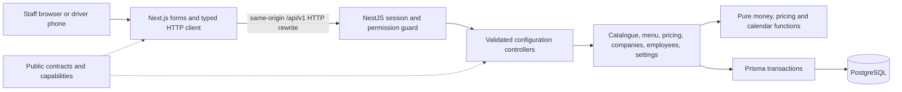
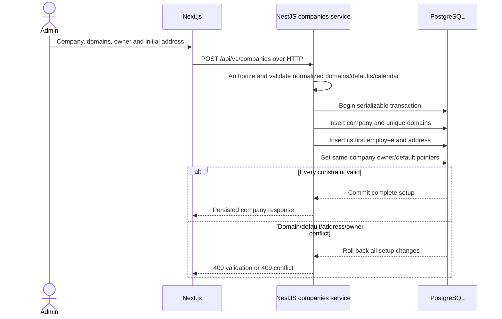
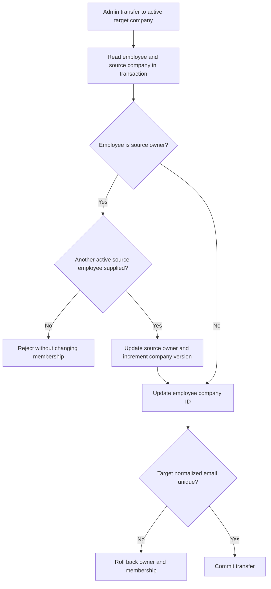
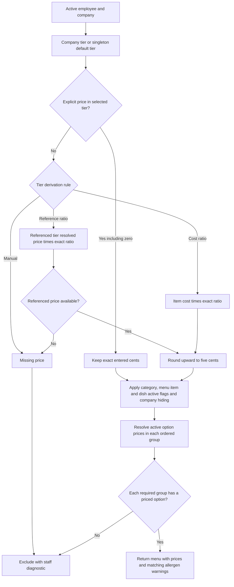

# Implemented architecture through Phase 1

The browser renders Next.js forms and calls relative `/api/v1` URLs. Next.js rewrites those requests over HTTP to NestJS. Authentication, permissions, validation, pricing, calendars and Prisma access belong to the backend. No Next.js page/server action accesses Prisma.

All protected requests read current staff activation/role and session expiry. Mutations also validate exact `Origin` and session-bound CSRF. Configuration routes require Admin capabilities; direct non-Admin API requests fail even if a client shows a button. Missing access policies fail closed. API errors have a request ID and actionable code/message; responses use `no-store`.

## Actual configuration data model

```mermaid
erDiagram
    STAFF_USER ||--o{ SESSION : authenticates
    STAFF_USER o|--o{ COMPANY : default_driver
    COMPANY ||--|{ EMPLOYEE : employs
    EMPLOYEE o|--o| COMPANY : owner
    COMPANY ||--|{ COMPANY_DOMAIN : claims
    COMPANY ||--|{ COMPANY_ADDRESS : has
    COMPANY_ADDRESS o|--o| COMPANY : default_address
    PRICE_TIER o|--o{ COMPANY : selected_tier
    PRICE_TIER ||--o| KITCHEN_SETTINGS : default_tier
    PRICE_TIER o|--o{ PRICE_TIER : reference_rule
    DISH ||--o{ DISH_OPTION_GROUP : defines
    DISH_OPTION_GROUP ||--o{ GROUP_OPTION : contains
    OPTION ||--o{ GROUP_OPTION : reused
    CATEGORY ||--o{ MENU_ITEM : contains
    DISH ||--o{ MENU_ITEM : appears_in
    COMPANY ||--o{ COMPANY_HIDDEN_CATEGORY : restricts
    CATEGORY ||--o{ COMPANY_HIDDEN_CATEGORY : hidden_for
    COMPANY ||--o{ COMPANY_HIDDEN_MENU_ITEM : restricts
    MENU_ITEM ||--o{ COMPANY_HIDDEN_MENU_ITEM : hidden_for
    PRICE_TIER ||--o{ DISH_TIER_PRICE : prices
    DISH ||--o{ DISH_TIER_PRICE : overridden_by
    PRICE_TIER ||--o{ OPTION_TIER_PRICE : prices
    OPTION ||--o{ OPTION_TIER_PRICE : overridden_by
    REFERENCE_VALUE o|--o{ DISH : station
    REFERENCE_VALUE o|--o{ COMPANY : packaging
    DISH ||--o{ DISH_ALLERGEN : contains
    REFERENCE_VALUE ||--o{ DISH_ALLERGEN : allergen
    DISH ||--o{ DISH_DIETARY_TAG : tagged
    REFERENCE_VALUE ||--o{ DISH_DIETARY_TAG : dietary_tag
    OPTION ||--o{ OPTION_ALLERGEN : contains
    REFERENCE_VALUE ||--o{ OPTION_ALLERGEN : allergen
    OPTION ||--o{ OPTION_DIETARY_TAG : tagged
    REFERENCE_VALUE ||--o{ OPTION_DIETARY_TAG : dietary_tag
    EMPLOYEE ||--o{ EMPLOYEE_ALLERGEN : guidance
    REFERENCE_VALUE ||--o{ EMPLOYEE_ALLERGEN : allergen
    EMPLOYEE ||--o{ EMPLOYEE_DIETARY_TAG : preference
    REFERENCE_VALUE ||--o{ EMPLOYEE_DIETARY_TAG : dietary_tag
```

The complete model is `apps/api/prisma/schema.prisma`; committed migrations add database checks. API-created companies have at least one domain/address/employee. Owner/default-address pointers are nullable only for intermediate setup; creation fills them before committing. Composite foreign keys pair the pointer with company ID, structurally rejecting a foreign-company owner/address. Each employee has exactly one required company. Emails are normalized and unique within their company; staff emails and company domains are globally unique. SKU is unique. Category/dish membership, option/group membership, reference joins and item/tier overrides have compound uniqueness.

ReferenceValue uses an enum kind for allergens, dietary tags, kitchen stations, portion sizes, packaging and public email-provider domains. Services validate the kind before assigning references. Records retire through active flags and retain joins. An active station used by an active dish, or packaging used by an active company, cannot retire until reassigned. Existing employee/dish allergen guidance remains readable after its reference retires.

Company and singleton KitchenSettings keep `workingDays` integer arrays (`0=Sunday` to `6=Saturday`) and `holidays` local-date arrays. This avoids extra lookup tables for a fixed seven-day week. Services validate unique days, at least one open day and real holiday dates. Settings fixes USD/Asia/Kolkata and references exactly one default tier. Company calendars determine delivery eligibility; only the kitchen calendar counts cutoff days.

Orders, snapshots, cutoff processing records, prep units, delivery drops, invoices and rolling operational fixtures do not exist yet. Their future relationships/state machines remain in [planned diagrams](diagrams.md).

## Atomic company setup and employee transfer

Company/settings saves include the last-read version. Conditional updates increment it and reject stale saves with 409. Configuration writes use serializable isolation for at most three attempts. Serialization/deadlock conflicts roll back before asynchronous 20/40 ms backoff; a persistent conflict returns `409 CONCURRENT_CHANGE`. This gives a winning transaction time to commit without holding locks during the delay. PostgreSQL uniqueness/FKs provide a second guard. Menu previews and price matrix reads use Repeatable Read for coherent configuration reads. Future order/invoice/fulfilment concurrency still needs its own checks.

## Effective pricing and menu availability

Tier references must be acyclic, including concurrent cross-reference edits. Integer/rational arithmetic uses BigInt intermediates, then validates the final PostgreSQL Int amount. Missing selected-tier prices do not look up the kitchen default as a fallback. Explicit overrides are not nickel-rounded. Secret categories are omitted from normal navigation; direct staff preview evaluates the same visibility/pricing rules. Optional groups may have no available option; required groups cannot.

These helpers/services are the foundation for Phase 2 quotes and snapshots. Phase 1 previews do not place orders, consume quantities or enforce employee flags on nonexistent order operations.
