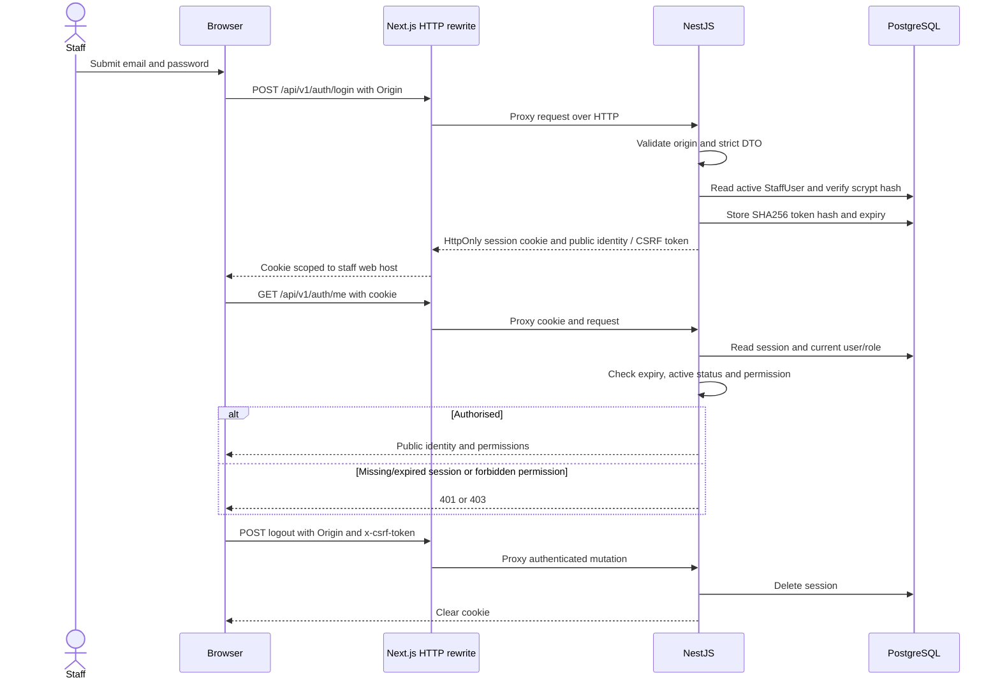
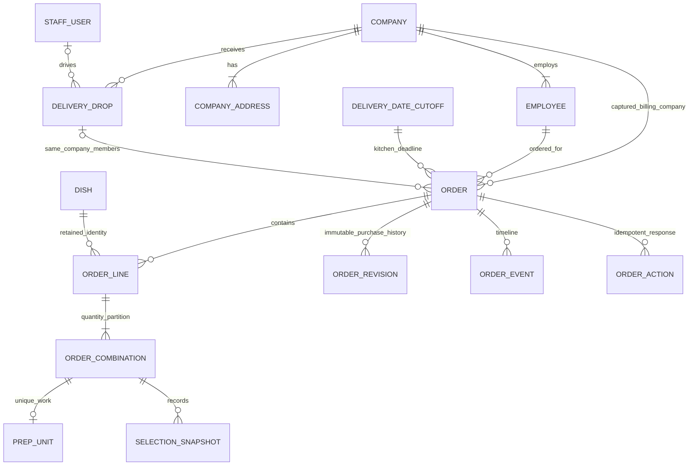
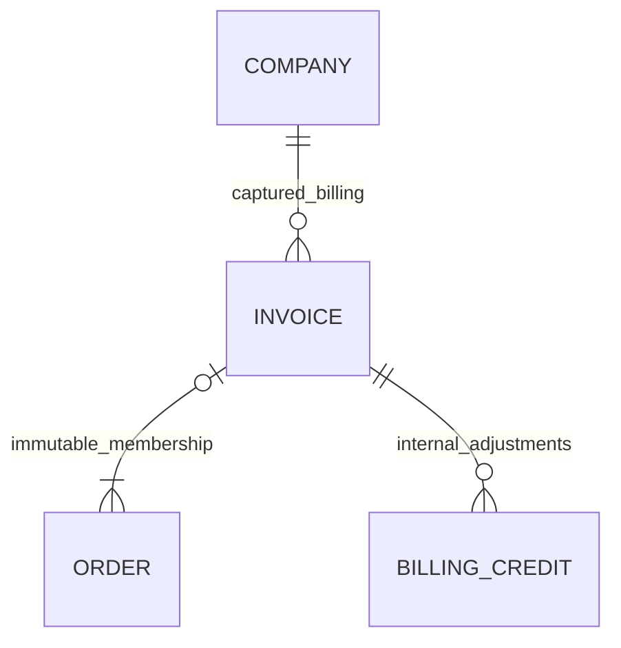
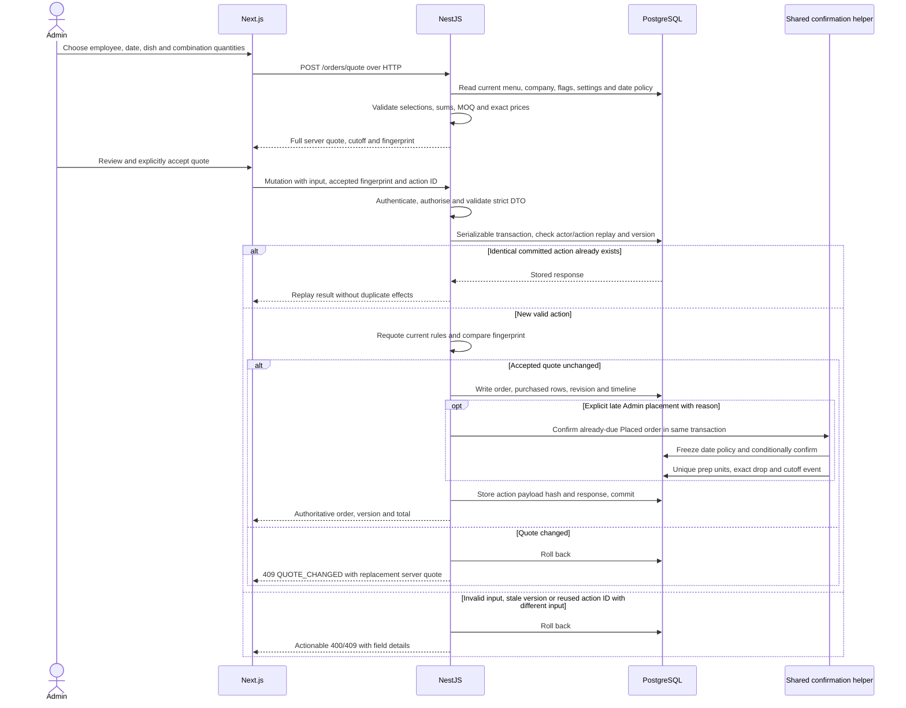
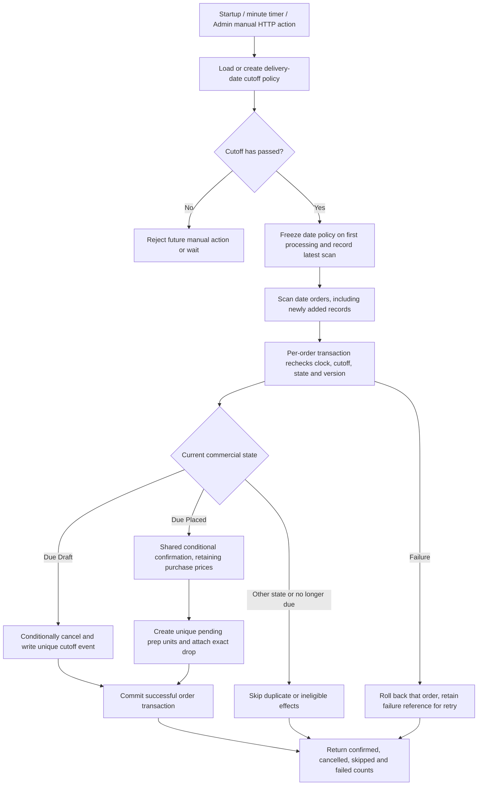
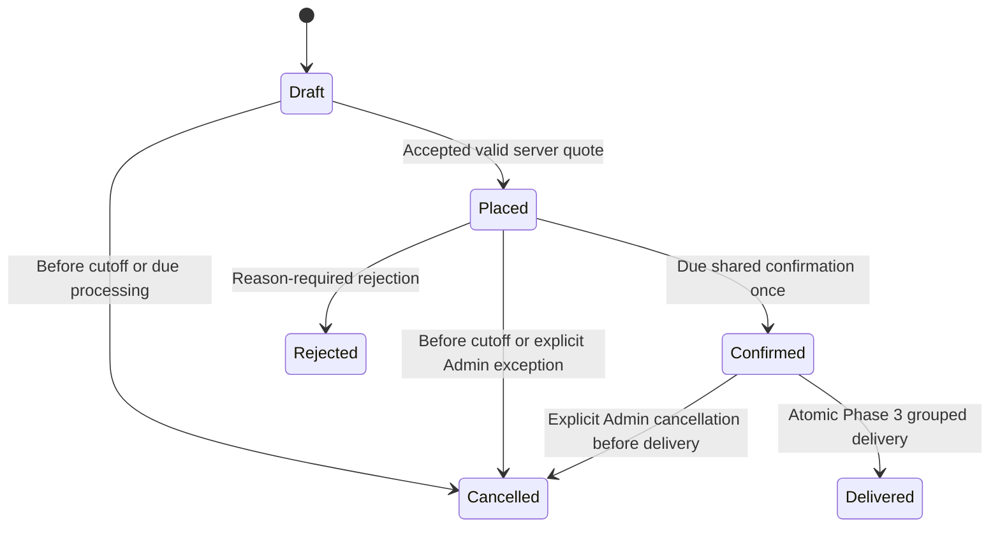
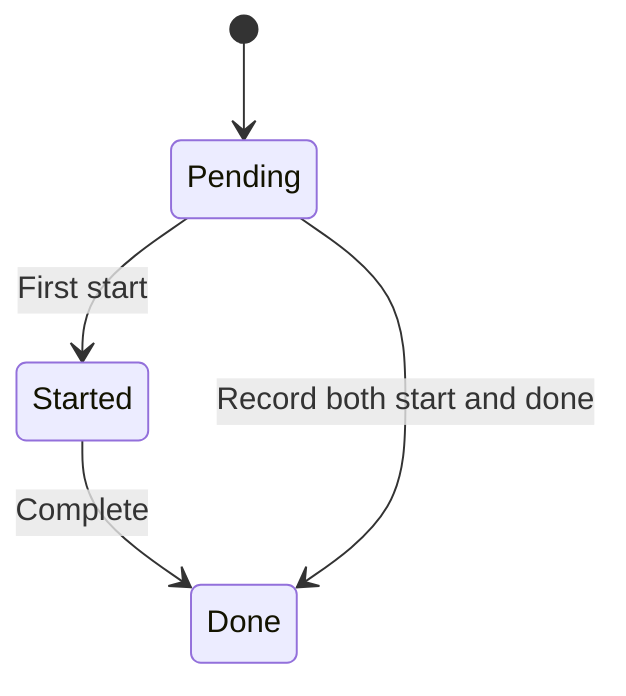
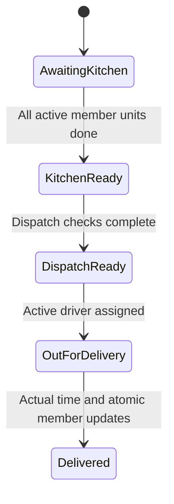
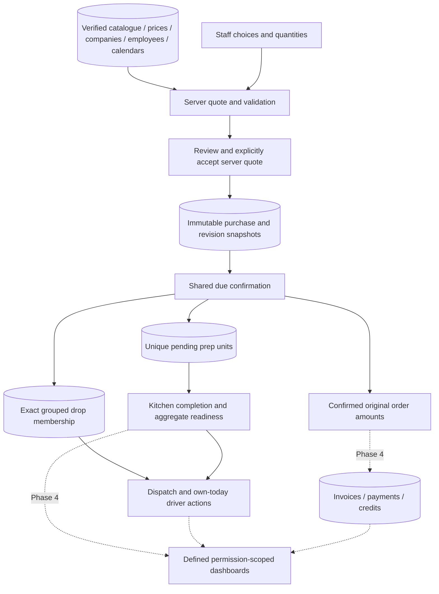

# Architecture and lifecycle diagrams

The current application includes configuration, orders/cutoffs, kitchen, grouped dispatch/Driver, billing/credits, staff management, role summaries and rolling review fixtures. Release fixes and actual checks are tracked in [release verification](release-verification.md), [billing evidence](phase-4-release.md), [demo jobs](demo-fixtures.md) and [deployment record](deployment.md). Historical phase evidence below describes its original checkpoint; live verification is a separate gate.

## Phase 0 authentication and HTTP boundary

The CSRF value is an HMAC derived from the opaque token. Its validation does not replace the exact `WEB_ORIGIN` check. Current account active status/role are checked on each request; token contents do not grant a stale role. Explicit route policies fail closed when absent.

## Phase 2 persisted business relationships

This core diagram omits the configuration joins shown in [architecture](architecture.md). Drafts may have no lines; placement requires valid lines/combinations. Staff login identities and customer employee records stay separate. Operational action endpoints are not implied by the existence of prep/drop tables.

An order retains its captured company even when the employee transfers. Purchase snapshots and unique order/version revisions preserve company/delivery/dish/options/quantities/prices; current logistics can change separately. Dish remains a restricted live FK, while menu item, selection group/option/tier and prep-station IDs are historical scalars without live FKs. Historical actor IDs also remain scalars, with event actor names captured. Replacing a catalogue group therefore cannot erase past selections. Events sort by timestamp and a unique increasing sequence, keeping same-millisecond placement/confirmation history stable.

One canonical combination on its original line creates one unique prep unit at confirmation; equal combinations on different orders remain separate work. Drops group by company, normalized actual address and exact UTC delivery instant. Address label/ID, employee and packaging are not grouping keys. The composite order/drop/company FK prevents cross-company membership. Invoice membership and credits are persisted; their relationship is shown below.

## Implemented and locally verified quote and mutation sequence

The backend quote-policy provider and order controller/service are registered. The user's confirmed policy chooses exactly one option in required groups, zero/one in optional groups, rejects duplicate dish lines and restricts ordinary addresses to active saved company addresses. Variants use combinations; canonical duplicate combinations merge within their line. Custom addresses and employee-flag exceptions require an explicit reasoned Admin override. The builder acceptance controls and new order journeys have passing local browser evidence.

The server fingerprint represents resolved employee/company/delivery/pricing/cutoff/purchase values. The frontend never calculates authoritative totals. Draft saves can have no lines and do not imply placement; each supplied line must still have valid combinations. Accepted placed purchase revisions are append-only. A changed quote returns its replacement for review/acceptance. Post-transfer Placed purchase edits are blocked, while explicit logistics/cancellation paths preserve the original purchase. Late creation or draft placement returns and caches Confirmed only after the shared confirmation effects succeed in that same transaction; retries replay that committed response.

## Implemented and locally verified due-cutoff processing

`DeliveryDateCutoff.processedAt` freezes policy; it does not mean every row succeeded. Retrying a date rescans orders, recovering failed/new records without duplicate transitions/work/events. Per-order processing rechecks the delivery date as well as state/version, so a concurrent reschedule cannot confirm under the old date's policy. Late Admin creation or explicit draft placement calls the same helper inside placement, so failure rolls back purchase, confirmation and cached response together. Future placement stays Placed.

Kitchen-settings edits recalculate only unprocessed date policies and affected Draft/Placed deadlines/versions in one transaction, adding `CUTOFF_CHANGED` events. Catch-up begins after commit. Processed dates retain their policy; company-calendar edits that close live order dates return conflicts with order links. Asia/Kolkata supplies local dates; persisted deadlines/delivery times are UTC instants. Startup, timer and manual handlers share this service; hosted scheduling has not been verified.

## Commercial order states: orders plus Phase 3 grouped delivery

Commercial order state is separate from preparation and delivery state. Phase 2 lifecycle endpoints and the builder have passing HTTP/database/browser evidence. Phase 3 implements Delivered through a grouped drop transition, with focused PostgreSQL evidence; its local browser/regression/policy gate passes.

Ordinary Draft/Placed purchase edits and cancellation lock at the exact cutoff. Explicit Admin exceptions require reasons and optimistic versions. Predeparture delivery corrections can regroup Confirmed orders without repricing; departed/delivered corrections use the reasoned drop-wide workflow. Confirmed cancellation clears active drop membership while preserving purchased preparation rows/actual history and incrementing its drop version. Active Kitchen reads include only Confirmed parents. Delivered orders retain their delivery fact; later shortages/credits belong to Phase 4.

## Phase 3 preparation and drop transitions — locally verified

Confirmation creates Pending prep units and grouped drops. These start/done/readiness/dispatch/Driver commands are implemented and have 23 focused PostgreSQL cases passing. The local Phase 3 gate passes final regression/browser checks and both confirmed packaging/reassignment policies; [Phase 3 evidence](phase-3.md) records the precise open work.

Serializable transitions and action replay protect repeated/concurrent commands, aggregate readiness and grouped member updates. Direct completion records a start as well as done. Predeparture regrouping invalidates dispatch checks; every membership change versions the drop even when its state stays unchanged. Current status is the gate, while immutable readiness events preserve before/after actual timestamps. A departed-drop correction is drop-wide and keeps the original target/outcome. The user confirmed packaging invalidation before departure/locking afterward and reasoned Admin travelling-Driver reassignment; implementation and applicable checks for those additions pass.

## Data flow: implemented orders/operations into planned billing/dashboards

Catalogue changes affect fresh quotes, not accepted historical prices. Current logistics remain visible separately from recorded purchase snapshots. Future dashboard figures must use the exact status/date/cancellation/missing-data definitions in README and reconcile to linked records. README and Phase 2 evidence record the passing local backend/browser/build/container checks and track commit/push/CI separately. Hosted smoke checks remain blocked.
