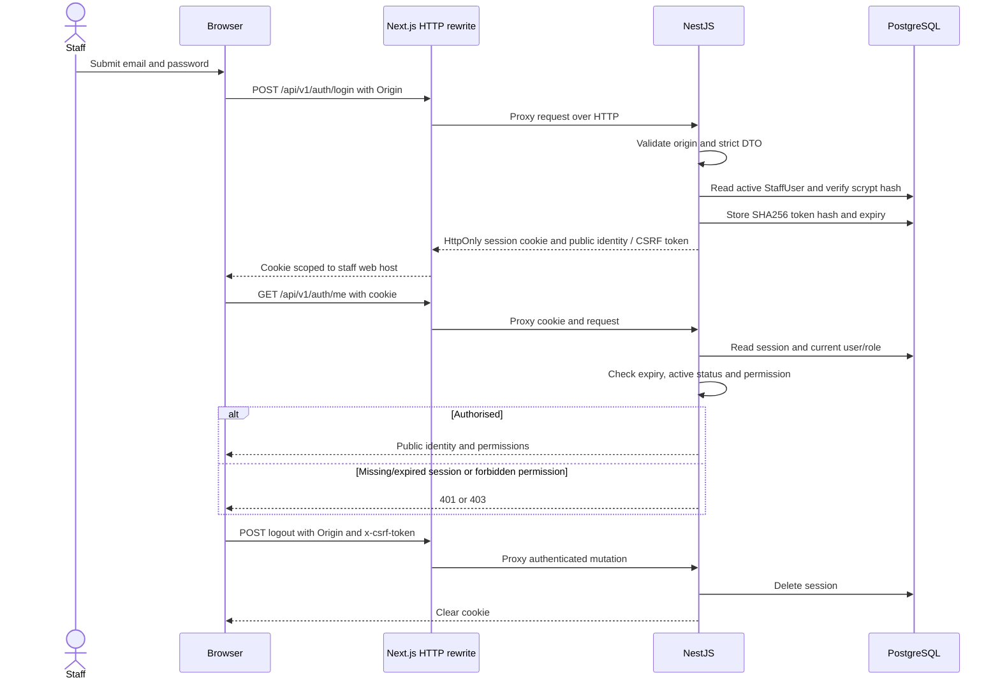
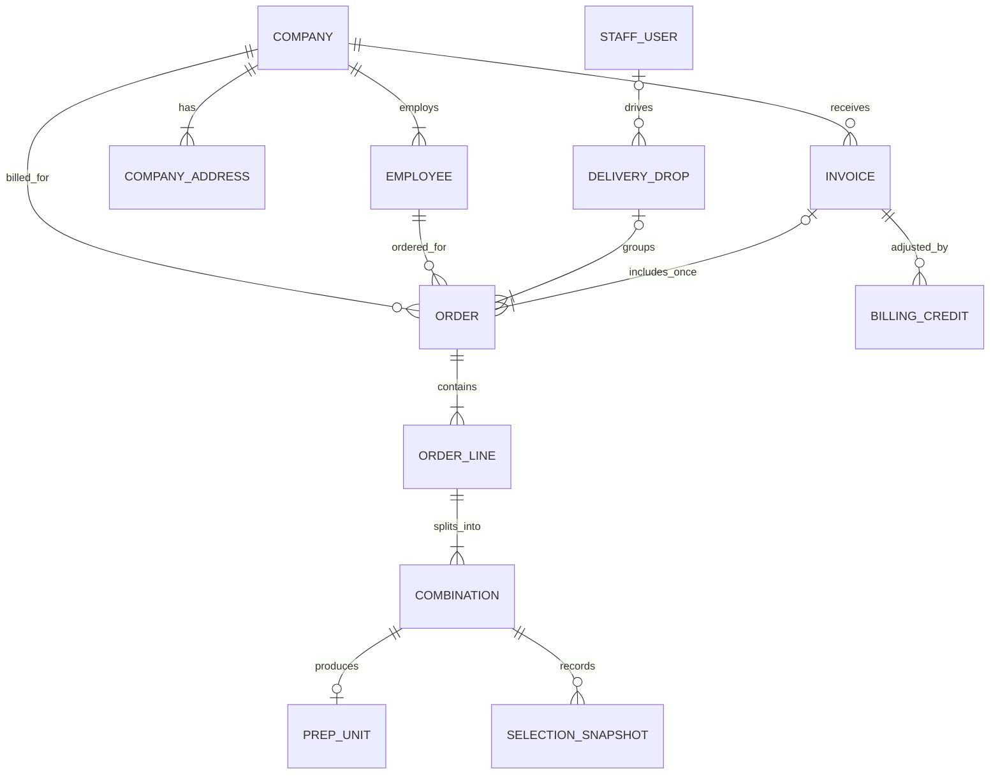
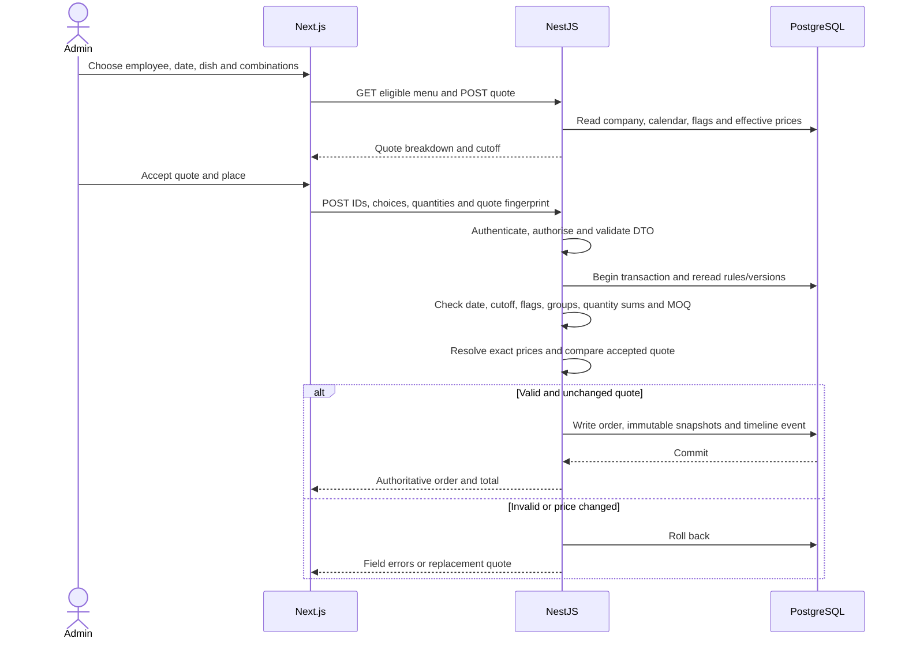
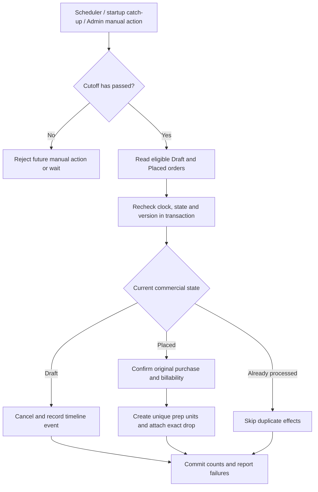
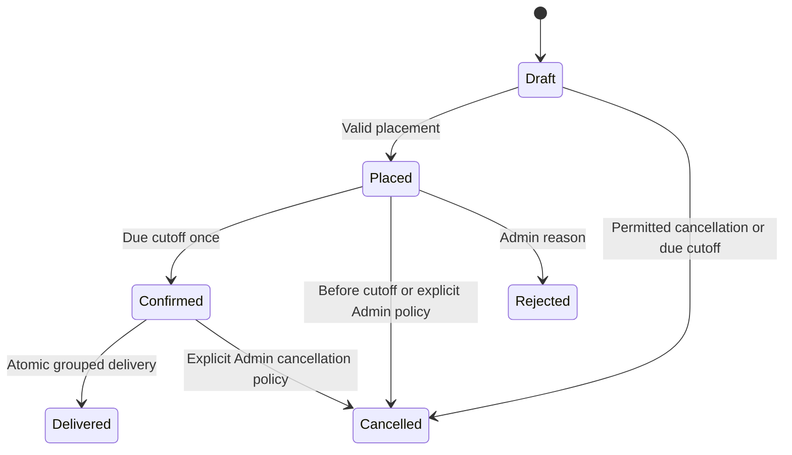
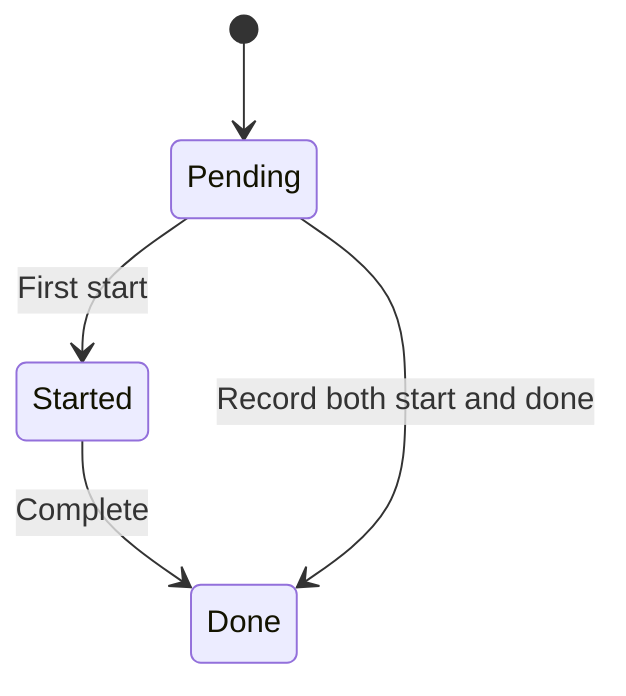
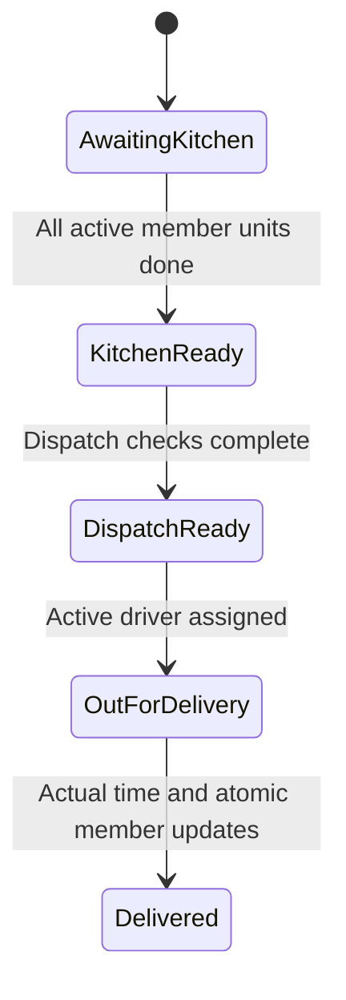
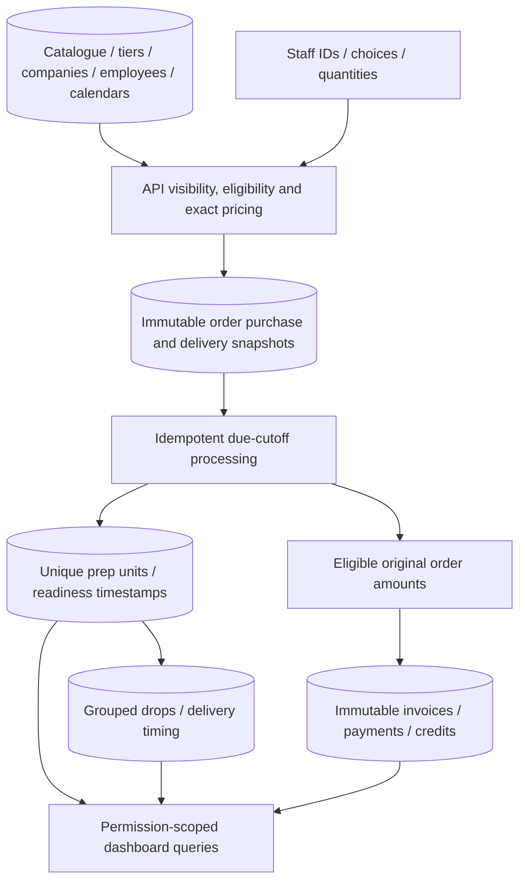

# Architecture and lifecycle diagrams

The authentication sequence describes Phase 0. The business ER, activity, state and data-flow diagrams are **planned blueprint models**. Only StaffUser and Session exist in the Phase 0 schema. See [README](../README.md) for evidence/status and the [blueprint](../Heizen-Implementation-Blueprint.md) for complete requirements.

## Phase 0 authentication and HTTP boundary

The CSRF value is an HMAC derived from the opaque token. Its validation does not replace the exact `WEB_ORIGIN` check. Current account active status/role are checked on each request; token contents do not grant a stale role. Explicit route policies fail closed when absent.

## Planned business relationships

This core diagram omits reference/option/menu joins and temporarily incomplete Draft children. A Placed order requires valid lines/combinations. Staff login identities and customer employee records stay separate.

Placement captures company/address/dish/option/quantity/price snapshots. Mutable reference IDs permit navigation without becoming the source of historical amounts. Invoice membership is unique per order. One prep unit represents one combination on its original line; equal dishes on different orders remain separate work records. Drops share exact company, canonical actual address and delivery instant.

## Planned order placement sequence

## Planned due-cutoff activity

One date-processing record does not replace conditional transitions and unique side effects. Retrying a due date also finds newly eligible Admin/demo records without duplicating prior work.

## Planned separate state machines

Commercial order state is separate from preparation and delivery state.

Concurrent/repeated commands use conditional transitions and idempotency. Pre-departure regrouping can invalidate readiness; a departed-drop correction is drop-wide. Completed history retains actual timestamps and the target captured at departure.

## Planned business data flow

Catalogue changes affect future resolution, not past snapshot amounts. Future dashboard numbers follow exact backend-query definitions in README and reconcile to linked source records.
