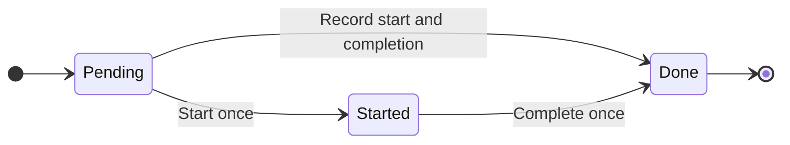
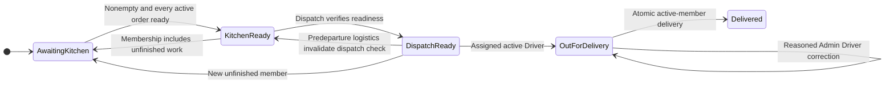
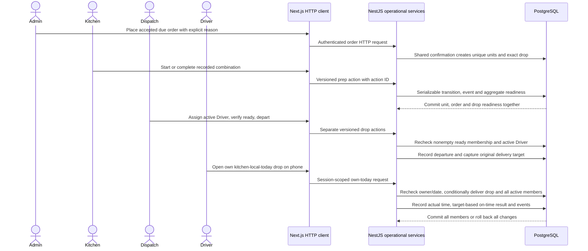
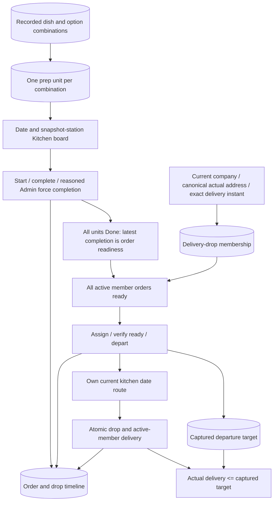

# Phase 3: kitchen through delivery

Status: **implemented and locally verified**, completed on 4 October 2026. Additive migrations `20261004030000_phase_3_operations`, `20261004030500_operation_history_immutable` and `20261004031000_readiness_history_system_actor` passed on development, guarded integration-test and separate browser-test databases, bringing each to eight migrations without resetting reviewer records or purchased snapshots. They add operational versions/replay/readiness/history, UPDATE protection for DropEvent and nullable automatic-event actors. Both user-confirmed policies below are implemented and tested. Lint/types/build, all 143 backend tests, the three affected production browser journeys and separate 400-order API/browser checks pass. Completion commit 1389fa90720f8b89b375e422ba58def7a0520c2f was pushed and remote-verified on public origin/main; CI is pending. No hosted acceptance is claimed: Vercel/Railway access is pending, and the original assignment PDF/submission instructions are absent.

## Acceptance gate and scope

| Gate | Current evidence |
| --- | --- |
| One order travels through Admin placement, Kitchen completion, Dispatch departure and Driver delivery | PASS: API journey and final production cross-role browser case, including grouped delivery |
| One preparation unit per recorded distinct combination; safe start/direct completion/all-unit readiness | PASS: direct/idempotent/final-unit/final-order race cases and full backend regression |
| Station/status/date board, separate units/meals, planned/actual readiness, late/at-risk/missing-plan handling | PASS: timing boundaries and guarded 400-order API/browser pagination/filter checks |
| Reason-required Admin force completion; non-Admin direct requests denied | PASS: HTTP/reason/history and production browser cases |
| Exact grouped drops, active Driver assignment, readiness/departure preconditions and atomic member delivery | PASS: HTTP/concurrency cases and travelling Driver reassignment browser journey |
| Driver only reads/writes own kitchen-local-today drops; phone-width journey | PASS: direct ownership/date/replay checks and 390 × 844 production delivery journey |
| Safe cancellation/regrouping/packaging correction, departed drop-wide corrections and immutable target/history | PASS: HTTP/concurrency/history and reasoned correction/reassignment browser cases |
| Lint, type-check, PostgreSQL tests and production builds pass | PASS: final lint/types/build; 143 backend tests across nine suites |
| README/diagrams current; phase commit and remote/CI verified | Documentation updated; completion commit pushed/remote-verified; CI pending |

Billing, invoice credits, role-dashboard aggregates and rolling review fixtures remain Phase 4. The guarded 400-order busy-day API/browser kitchen checks pass; the overall deployed/all-Must release gate remains Phase 5. Optional delivery photos remain deferred; delivery works without a photo.

## Confirmed user policies

On 4 October the user explicitly chose both recommended policies:

1. **Packaging:** a change before departure invalidates Dispatch readiness without changing the company/address/time grouping key; packaging locks after departure. Completed prep/actual history and recorded purchase amounts remain.
2. **Travelling Driver assignment:** Admin may reassign an Out-for-delivery drop's active Driver through a reason-required exception. Dispatch assignment stays before departure; Delivered retains its Driver. Reassignment records before/after Driver and reason, retains actual departure/original target, and makes the old Driver lose fresh own-today access.

These are explicit user decisions rather than extra wording attributed to the missing assignment PDF. `rules.md` invariant 12 preserves them. Both policies have passing direct API/concurrency tests; travelling Driver handover also has production browser evidence.

## Behavior and diagram record

The blueprint requires three separate state machines. Verified Phase 3 behavior preserves Confirmed as the commercial state while preparation/dispatch advance; only successful grouped delivery changes active member orders to Delivered. The diagrams below match the current services and passing API/browser evidence.

## Measured 400-order kitchen query check

`pnpm --filter @fernleaf/api test:integration --runTestsByPath ../../tests/integration/kitchen-load.spec.ts` **PASS: one test in 7.544 seconds**. It creates two purchases through the actual order API, confirms them through shared cutoff processing, then copies their recorded history into a clearly labelled synthetic workload inside the guarded `_test` database. Dataset: 400 Confirmed orders, 400 unique Pending prep units, 800 meals and two snapshot stations. It does not reset or append the development/reviewer database.

| HTTP read | Local elapsed | Observed node-postgres SQL calls | Response bytes |
| --- | --- | --- | --- |
| One-unit page | 45.5 ms | 13 | 1,300 |
| First 100-unit page | 70.0 ms | 13 | 106,439 |
| Second 100-unit page | 53.1 ms | 13 | 106,441 |
| Cold-station Pending filter, first 100 of 200 matches | 51.7 ms | 13 | 106,541 |

Calls include authentication and transaction queries. Assertions verify total 400, distinct stable pages, correct meal/unit quantities, two station choices, correct 200-match station/status filter and SQL count independent of page size. These are local process/database observations, not a hosted latency guarantee.

## Checks and publication

The focused `operations.spec.ts` PostgreSQL suite passes **23/23 in 44.650 seconds**, with all eight migrations and the registered application. It covers role/auth/CSRF/field redaction; snapshot-only Confirmed work and cancellation exclusion; direct-completion start/done and earliest/latest readiness; action replay/key binding; same-state membership versions and travelling cancellation; simultaneous final units/final member orders; reasoned force history; exact risk boundaries; missing/inactive Driver and invalid dispatch states; all four roles; atomic concurrent delivery; fresh own-today scope on replay; predeparture regrouping; empty drops; regroup-versus-departure; whole departed/delivered corrections preserving original target/outcome; immutable history and grouping collisions. Packaging invalidation/locking, travelling reassignment role/reason/history checks, immediate old-Driver access loss and reassignment-versus-delivery races pass. Historical unchanged-date metadata correction remains possible after a later company-calendar closure; changing the date validates the new current calendar.

Final `pnpm lint`, `pnpm typecheck` and `pnpm build` pass after all policy/UI fixes. `pnpm test:integration` passes **143 tests / nine suites in 143.716 seconds**, exit 0. The final affected production browser command, `pnpm test:e2e tests/e2e/operations.spec.ts`, passes **all three cases in 26.4 seconds**, exit 0: cross-role preparation/grouped phone delivery, reasoned force/correction/history and travelling Driver handover. Phone output was visually inspected and is legible without horizontal overflow. The first complete run passed 21 of 22 cases and exposed a real Driver-selection loss during background version refresh; preserving the local selection fixes it, verified by the final affected journey. The 21 unchanged cases were not repeated after that fix, following the user's instruction to finish promptly; a final full 23-case local rerun is not claimed. CI is configured for all 23 ordinary cases. No tests were weakened or removed.

Publication must record the actual phase commit, branch, full remote hash and CI result after push. Phase 3 local acceptance is complete; completion commit 1389fa90720f8b89b375e422ba58def7a0520c2f is pushed and remote-verified on origin/main. CI remains pending. Hosting/source access remains separate. The API Docker image/container was verified for Phase 2; a Phase 3 image/hosted rerun is not claimed.

The separate read-only browser command is `pnpm test:kitchen-load-ui`. Its `playwright.workload.config.ts` requires `E2E_BASE_URL` to an already-running **local HTTP origin**, starts no servers and creates no fixtures. Prepare the guarded 400-order API dataset separately, then point the local web/API at that isolated database. The `.check.ts` filename is excluded from normal Playwright discovery; explicit `--list` verification found 23 ordinary cases in five files and exactly one dedicated case. The workload browser case **passes 1/1 in 4.9 seconds** (case 3.8 seconds) at 1280 × 900 with America/Los_Angeles timezone. It verifies all eight 50-card pages with 400 unique IDs/800 meals, the 200-unit Cold-station subset/four pages, Pending status and no page errors or unexpected non-login writes. Local read/render observations: first page **380.4 ms**; subsequent pages **262.5, 234.2, 261.9, 262.6, 243.7, 228.9 and 244.9 ms**; station filter **175.0 ms**; Pending filter **205.9 ms**. Timings are observations, not fixed production guarantees. Visible-viewport screenshots are captured in ignored `test-results/kitchen-workload`; later ordinary Playwright runs may clean that output.

The ordinary browser suite requires one additional synthetic Driver for handover, installed by `pnpm test:seed-browser` only on a local database ending `_browser_test`: `replacement-driver@test.com` / `Test@1234`. Its insert-only seed refuses the application and integration databases and preserves existing records. This fifth test-only staff fixture does not alter the exact four demo accounts. [README isolated browser setup](../README.md#build-and-checks) documents setup; CI uses a separate `fernleaf_browser_test` database. Billing/dashboards/rolling review fixtures are the next Phase 4 task after this phase's report.
